# Let zurg fetch what Radarr and Sonarr want

Radarr and Sonarr keep the list and the library. zurg does the fetching. The first half of this page is Radarr. [The second half](#sonarr) is Sonarr, which works the same way for episodes.

Radarr keeps the list and the library. zurg does the fetching. Add a movie to Radarr however you like and zurg finds a release on your Usenet indexers. It checks that the release is still on the news servers. Then it puts the video in the movie's folder and asks Radarr to look. Nothing is downloaded to import and nothing is copied. The movie simply has a file.

Radarr needs no indexers and no download client for this. It never searches and never grabs. Your quality profile still decides what zurg is allowed to take.

Everything below was captured against the zurg build that ships as the 26 September 2026 nightly, Radarr 6.3.0.10514 and Sonarr 4.0.20.3014 in Docker. Both saw zurg's mount at `/mnt/zurg` inside their containers. Nothing in the captured screens was altered.

## Before you start

Four things have to be true.

1. **zurg has a Usenet account and at least one Newznab indexer.** The indexers go in zurg's config under `acquisition.indexers`. The [Watchlist and Seerr](acquisition.md) page covers that block.
2. **`magic.enabled` is `true`.** The Radarr and Sonarr sources do not start without it and say so in the log. See [`__magic__`](magic.md).
3. **Radarr can see the mount.** If Radarr runs in a container read [the Docker section](#if-your-radarr-is-in-docker) before you configure anything.
4. **You run a nightly from 26 September 2026 or later.** Older builds do not know the `radarr` or `sonarr` sources.

## 1. Tell zurg about Radarr

Add a `radarr` source under `acquisition` in `config.yml` and restart zurg. There is no dashboard form for this block yet.

```yaml
acquisition:
  quality: best
  indexers:
    - name: my-indexer
      url: https://indexer.example
      api_key: YOUR_INDEXER_API_KEY
  sources:
    - name: radarr
      type: radarr
      enabled: true
      url: http://radarr:7878
      api_key: YOUR_RADARR_API_KEY
      check_every_secs: 30
```

`url` and `api_key` are Radarr's own. The API key is under **Settings > General** in Radarr. `check_every_secs` is how often zurg asks Radarr what it wants. Every poll is one request for the movie list.

Two more keys matter when Radarr does not run where zurg does. `library_path` is where Radarr sees zurg's `__magic__` directory. Leave it out when both run on the same host and Radarr sees the mount where zurg mounts it. The Docker section below shows the other case. `concurrency` is how many titles zurg works on at once and defaults to eight. A big list is fine at the default. It only takes longer.

## 2. Point Radarr at `__magic__`

Radarr's root folder has to be inside `__magic__` and one level down. `/mnt/zurg/__magic__/movies` is the shape to copy. Not `__magic__` itself and not `__magic__/__all__`. A movie whose folder is anywhere else is skipped and zurg says so once in its log.

Open **Settings > Media Management** and add the root folder.

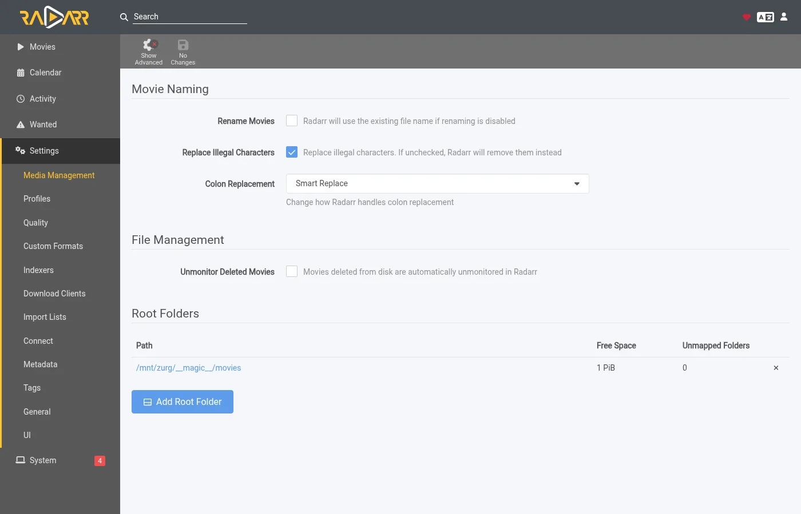

The free space Radarr reports is what the mount reports. Nothing is ever written there by Radarr.

## 3. Add movies with search on add off

Add movies the way you already do. By hand or from a list or from a request app pointed at Radarr. The one thing to change is the search. Leave **Search on Add** off because zurg is the one searching.

This walkthrough uses an import list. Open **Settings > Import Lists** and add or edit yours.


In the list's settings keep **Enable Automatic Add** on. Turn **Search on Add** off. Pick the quality profile and the root folder from step 2. Set **Minimum Availability** to what you want. zurg waits for Radarr to call a movie available before it looks for it.

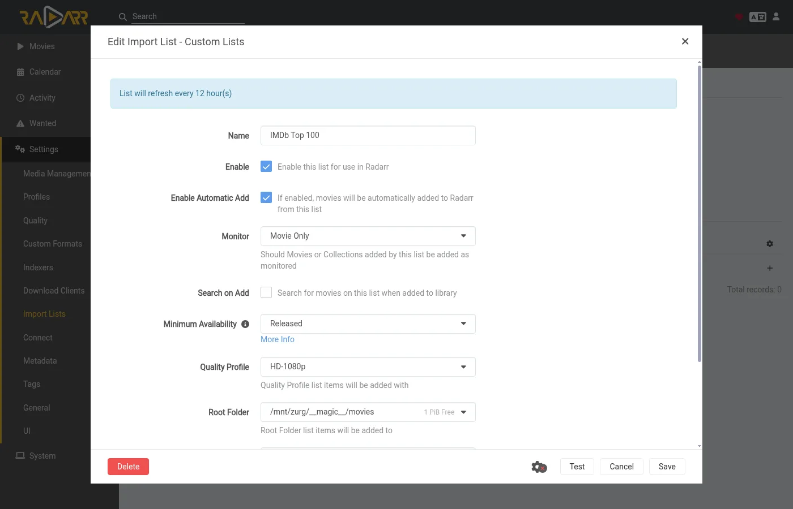

When you add a single movie by hand the same switch is called **Start search for missing movie**. Leave it off too.

## 4. Nothing else in Radarr

That is the whole Radarr side. The indexers page can stay empty.

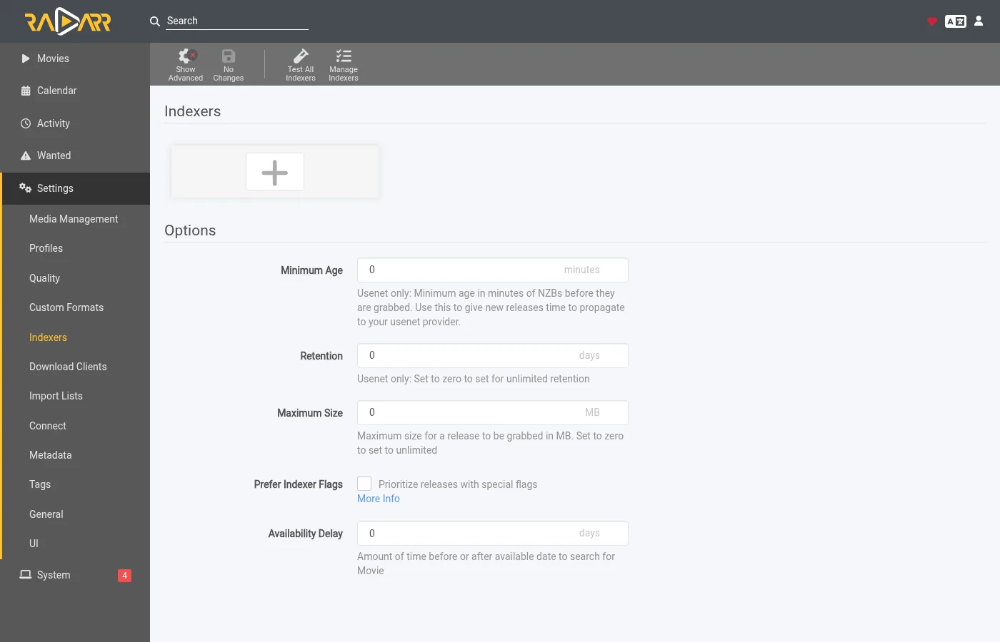

So can the download clients page.

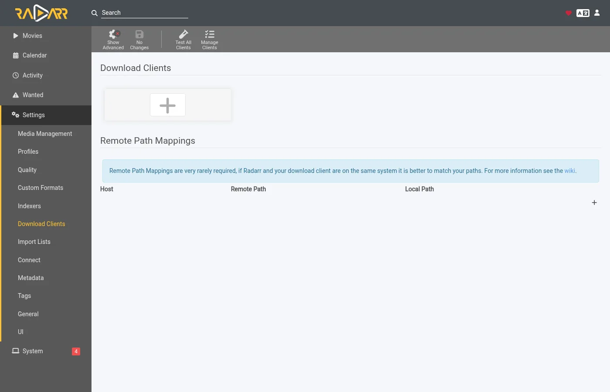

If Radarr already has indexers and a download client from an earlier setup they keep working. Radarr would then grab alongside zurg for the same movies. Turn off automatic search on those indexers or remove them for the movies zurg looks after.

## 5. Watch it work

Open zurg's dashboard. **Acquisition** is a new entry in the quick links.

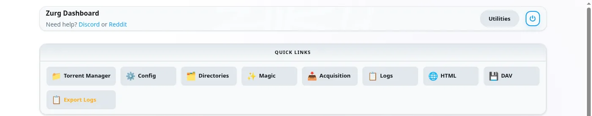

The page shows every title zurg is working on and what it is doing right now. This is a list of ten movies about half a minute after Radarr added them. Five have their file and Radarr is being told about them. The rest are done.

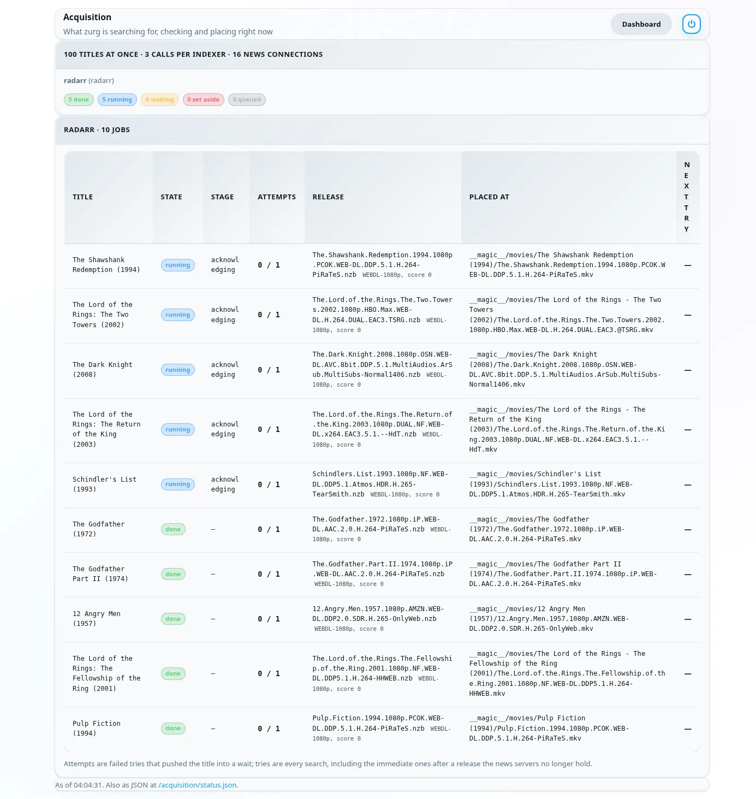

Each row is one movie. **State** is where it stands. **Stage** is what zurg is doing for it right now. It reads the indexers first. Then it judges the candidates. Then it reads a release's NZB and checks the post with the news servers. Then it places the file. **Release** is the post zurg took and what Radarr's parser made of it. **Placed at** is the path inside `__magic__` where the video now sits. A title the news servers no longer hold moves on to the next candidate at once. A title with nothing usable is set aside with the reason shown.

A minute later everything is done.


The same data is at `/acquisition/status.json` if you want to read it from a script.

## 6. What Radarr shows

Radarr's movie pages fill in as the rescans land. Every movie in this list has its file.


A movie's page shows the file in its folder inside `__magic__` with the quality Radarr read from the name.

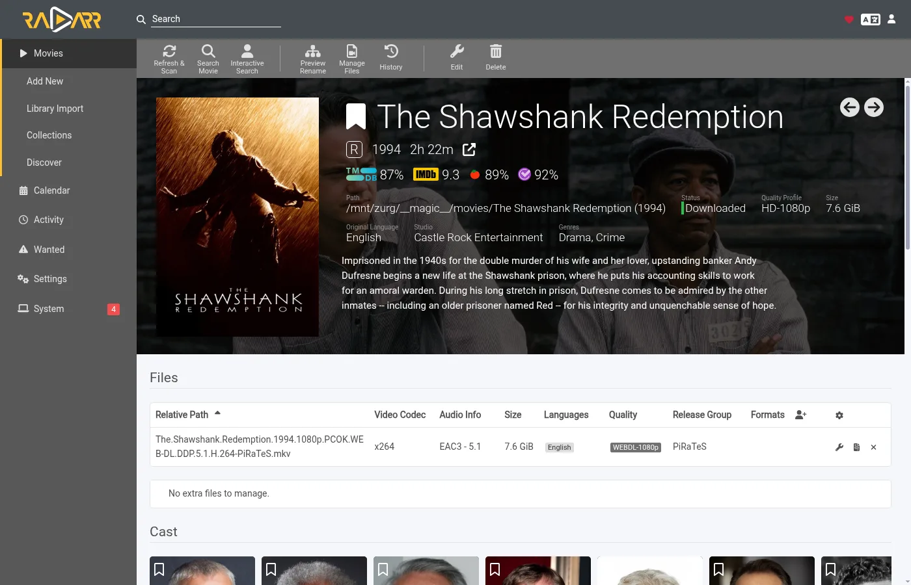

**Activity** stays empty. There is no queue entry and no grab or import event because Radarr grabbed nothing. The file simply appeared in the folder and the rescan zurg asked for picked it up.


Two things follow from that. Radarr's blocklist is never written because Radarr never grabbed. zurg keeps its own record of posts the news servers no longer hold and does not pick them again. And a movie you delete in Radarr is not deleted from your account. The file goes back to being listed under `__all__` like any other release.

## How zurg picks a release

Your quality profile is the gate. Every release zurg is about to take is put through Radarr's own parser first. It has to be the right movie. Its quality has to be allowed by the movie's profile. Its custom format score has to reach the profile's minimum and its size has to fit the limits under **Settings > Quality**. A release that fails any of those is not taken.

Among the releases the profile allows zurg takes the first one that is quickest to confirm. Posts that hold a single video file come first because they are the ones most often still complete on the news servers. Web releases come before Blu-ray ones for the same reason. Multi-volume archive sets are the fallback. The profile's order of preference is not used to pick among what it allows. It is served by upgrades instead. When the profile allows upgrades and the file zurg placed is below the cutoff zurg looks for a better release once the movie has one. Only a strictly better release replaces the file. A lower quality is never taken.

A movie dated in the future waits until Radarr calls it available. A search that turns up the wrong film is refused because Radarr matches the title to no movie of yours.

## If your Radarr is in Docker

Radarr in a container sees the mount wherever you bind it. zurg needs to know that path so it can turn a Radarr folder into a place inside `__magic__`. Set `library_path` to where Radarr sees `__magic__`.

```yaml
  sources:
    - name: radarr
      type: radarr
      enabled: true
      url: http://radarr:7878
      api_key: YOUR_RADARR_API_KEY
      library_path: /mnt/zurg/__magic__
```

With that a movie Radarr keeps at `/mnt/zurg/__magic__/movies/Heat (1995)` is placed at `movies/Heat (1995)` inside zurg's `__magic__`. Windows paths such as `Z:\__magic__` work the same way. The screenshots on this page come from exactly this arrangement. zurg mounted the library at one path on the host and Radarr's container saw it at `/mnt/zurg`.

## Sonarr

Sonarr works the same way. Sonarr keeps the list of series and the library. zurg reads the episodes Sonarr is missing and finds a release for them on your indexers. It checks that the release is still on the news servers. Then it puts each episode in its season folder and asks Sonarr to look. Sonarr needs no indexers and no download client for this either.

A season is one piece of work. When every episode of a season is missing and the season has finished airing zurg tries a season pack first. Otherwise it takes the missing episodes one by one. A season that already has some of its files never takes a pack, because that would put a second copy of those episodes in the folder.

### 1. Tell zurg about Sonarr

Add a `sonarr` source next to the Radarr one and restart zurg. The keys are the same.

```yaml
acquisition:
  sources:
    - name: sonarr
      type: sonarr
      enabled: true
      url: http://sonarr:8989
      api_key: YOUR_SONARR_API_KEY
      library_path: /mnt/zurg/__magic__
      check_every_secs: 30
```

The API key is under **Settings > General** in Sonarr. `library_path` is where Sonarr sees `__magic__`, exactly as it is for Radarr. Leave it out when Sonarr sees the mount where zurg mounts it. The same indexers serve both sources.

### 2. Point Sonarr at `__magic__`

Sonarr's root folder goes inside `__magic__` one level down, beside Radarr's. `/mnt/zurg/__magic__/tv` is the shape to copy. Open **Settings > Media Management** and add it under **Root Folders**.


**Season Folder Format** on the same page is the name zurg gives a new season folder. A season that already has files keeps the folder they are in.

### 3. Add series with search off

Add series the way you already do. When you add one by hand leave **Start search for missing episodes** unchecked and **Start search for cutoff unmet episodes** too. zurg is the one searching. **Monitor** decides what zurg goes after. This series is set to its first season.

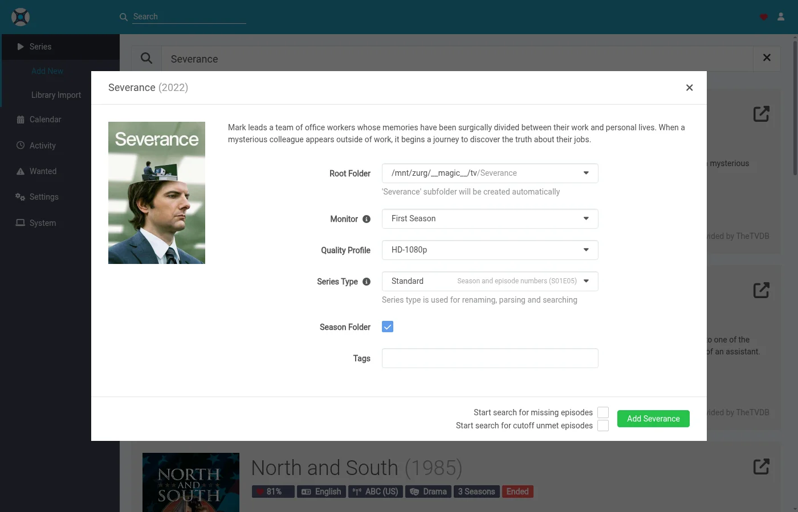

An import list has the same switch in its settings. Turn its search off too. Indexers and download clients can stay empty in Sonarr as they do in Radarr.

### 4. Watch it work

Sonarr's seasons show up on the same **Acquisition** page. One row is one season, or one episode file zurg is upgrading. Here are two series with their first season monitored, half a minute after they were added. Both seasons had finished airing and had no files, so zurg tried a season pack for each. The Severance pack is in its season folder and Sonarr is being told. The Only Murders pack is being checked with the news servers.

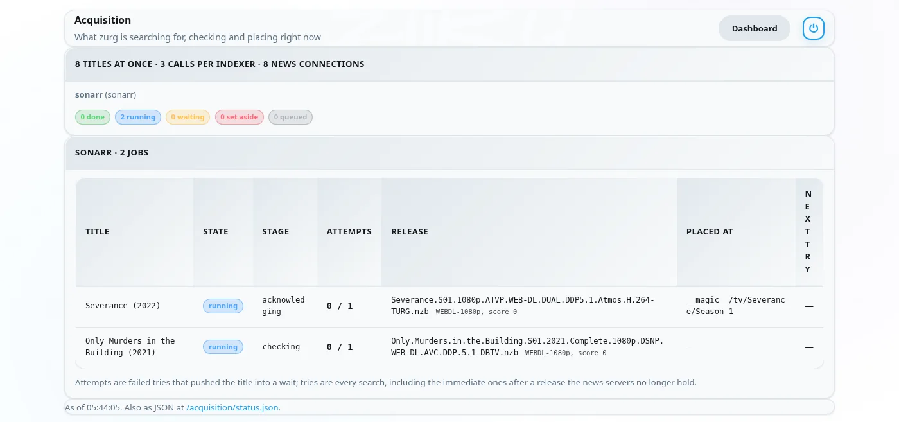

About two minutes after they were added both seasons are done. The Only Murders pack was missing pieces on the news servers, so zurg set it aside and took the ten episodes one by one instead. Its row shows the last episode placed.

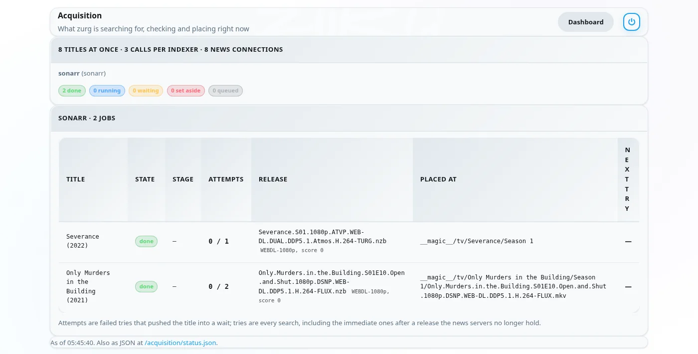

When one episode of a season has nothing zurg can take yet the rest are still placed and Sonarr is told about them straight away. The missing episode is looked for again later on the usual retry schedule.

### 5. What Sonarr shows

The season fills in once the rescan lands. All ten episodes have their file in the season folder inside `__magic__`, with the quality Sonarr read from each name.

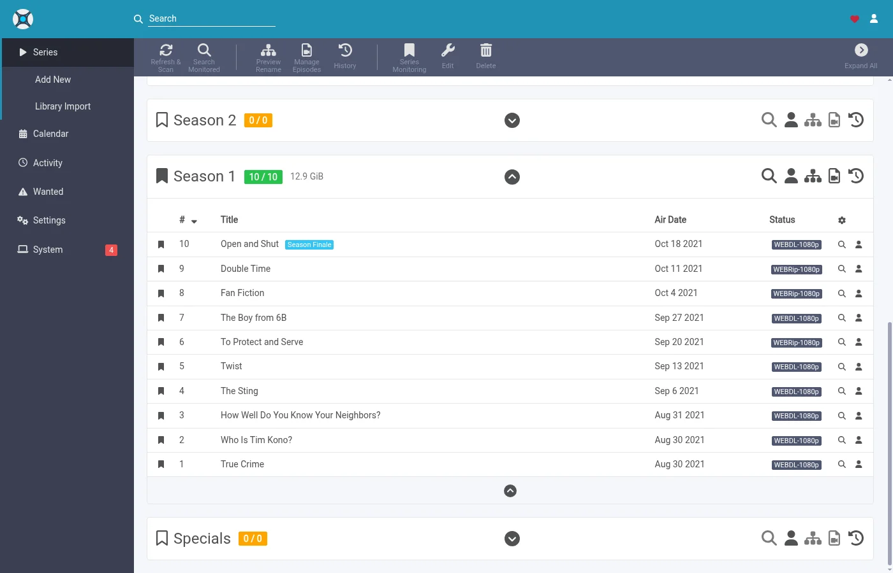

**Activity** stays empty for the same reason it does in Radarr.

### How zurg picks an episode

Every release is put through Sonarr's own parser and the series' quality profile. It has to be this series and this season. A pack has to be the whole season. An episode release has to be that one episode alone. The quality has to be allowed and the custom format score has to reach the profile's minimum. The size has to fit the limits under **Settings > Quality** for the runtime of the episodes the release holds.

When the profile allows upgrades an episode file below the cutoff is an upgrade. Below the cutoff means below the cutoff quality or below the cutoff custom format score. zurg counts both as Sonarr's upgrade rule does, although Sonarr's own **Cutoff Unmet** list only shows the first. An upgrade replaces only its own episode. The other episodes in the season folder stay where they are.

## Things to know

- **A change to `indexer_concurrency` needs a restart.** The other keys are read on every poll.
- **Radarr's rescan is the last step and it queues behind Radarr's own work.** Right after a list adds many movies Radarr refreshes each of them first. The files are already in place while that runs.
- **Analyse video files in Radarr reads the head of each file over the mount.** It works. It is also the slowest part of a big list. Leave it on unless you know you do not want media info.
- **Unmonitored movies are left alone.** So are movies whose folder is outside `__magic__`. The same goes for unmonitored series, seasons and episodes in Sonarr.
- **Specials, daily shows and anime are skipped for now.** A daily show's episodes are dates and anime is released under absolute episode numbers. zurg searches by season and episode, so it cannot find either yet. Each skipped series gets one line in the log.

The full description of both sources lives in [Watchlist and Seerr](acquisition.md) under **Radarr behavior** and **Sonarr behavior**.
