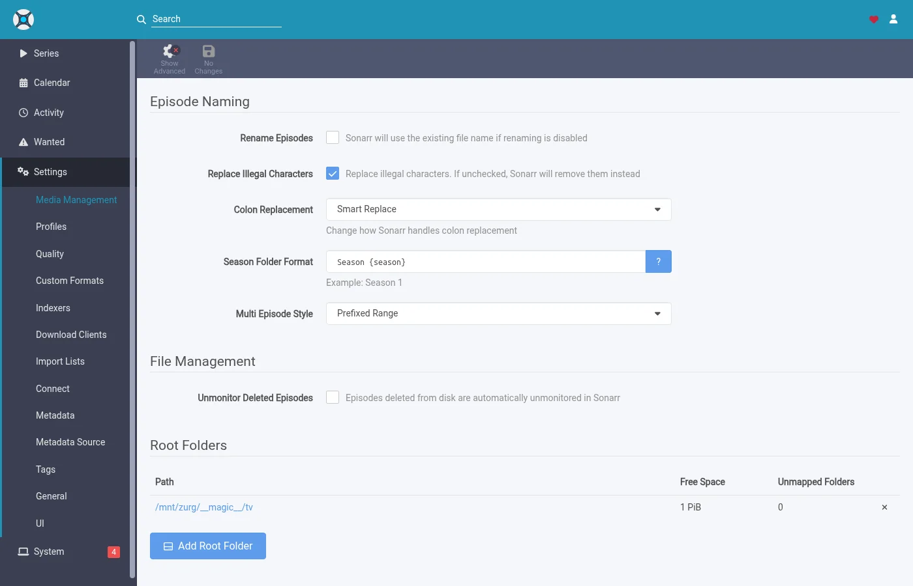
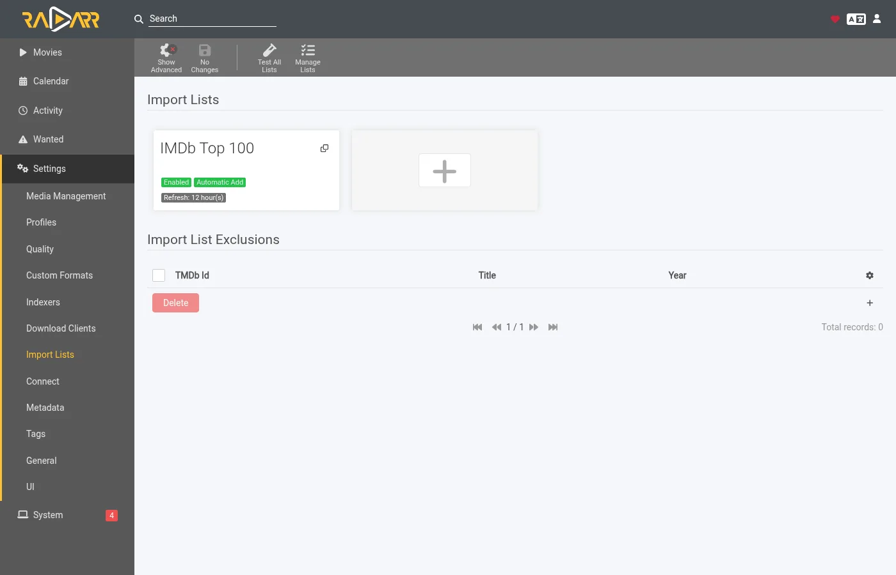
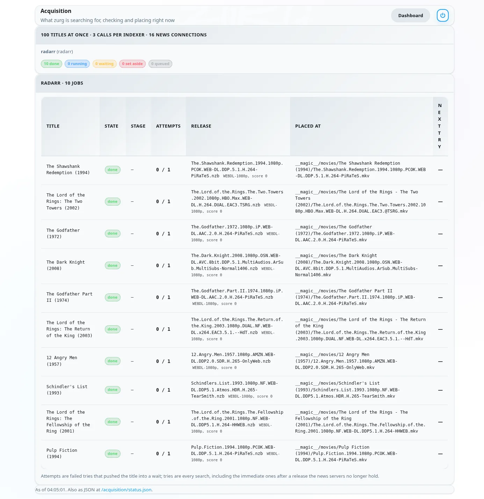
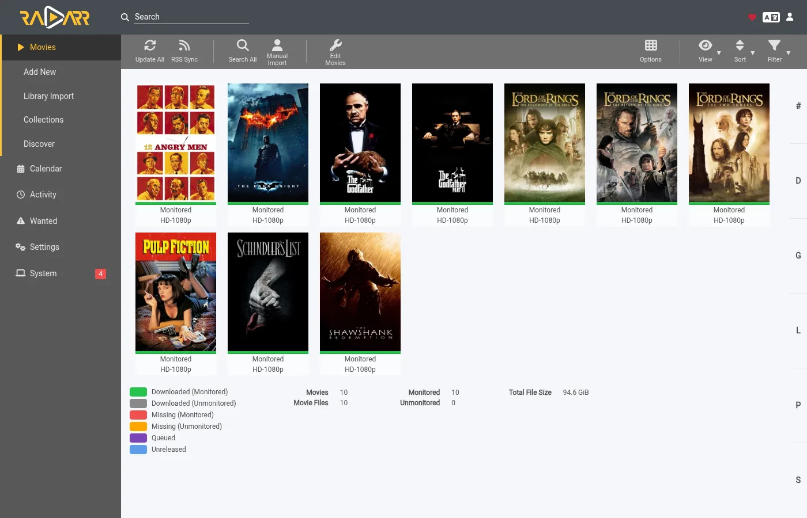
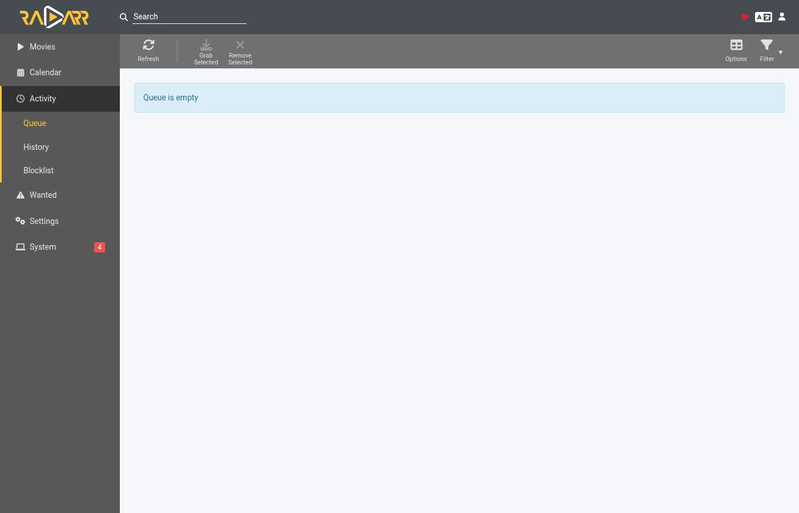

# Let zurg fetch what Sonarr and Radarr want

Radarr and Sonarr keep the list and the library. zurg does the fetching. Add a movie or a series the way you already do and zurg finds a release on your Usenet indexers. It checks that the post is still on the news servers. Then it puts the file in its folder inside `__magic__` and asks Radarr or Sonarr to rescan. Nothing is downloaded to import and nothing is copied.

Radarr and Sonarr need no indexers and no download client for this. They never search and never grab. Your quality profile still decides what zurg is allowed to take.

This is not the same setup as [Sonarr & Radarr](sonarr-radarr.md). There zurg is the download client and the arrs do the searching. Here the arrs do no searching at all.

The screenshots come from the zurg build that ships as the 26 September 2026 nightly with Radarr 6.3.0.10514 and Sonarr 4.0.20.3014 in Docker. Both saw zurg's mount at `/mnt/zurg` inside their containers. Nothing in them was altered.

## Before you start

1. **zurg has a Usenet account and at least one Newznab indexer.** The indexers go in zurg's config under `acquisition.indexers`. The [Watchlist and Seerr](acquisition.md) page covers that block.
2. **`magic.enabled` is `true`.** The Radarr and Sonarr sources do not start without it and say so in the log. See [`__magic__`](magic.md).
3. **Radarr and Sonarr can see zurg's mount.** In Docker that means binding it into their containers.
4. **You run a nightly from 26 September 2026 or later.** Older builds do not know the `radarr` or `sonarr` sources.

## 1. Tell zurg about Radarr and Sonarr

Add a `radarr` source and a `sonarr` source under `acquisition` in `config.yml` and restart zurg. There is no dashboard form for this block yet. Leave out the one you do not use.

```yaml
acquisition:
  quality: best
  indexers:
    - name: my-indexer
      url: https://indexer.example
      api_key: YOUR_INDEXER_API_KEY
  sources:
    - name: radarr
      type: radarr
      enabled: true
      url: http://radarr:7878
      api_key: YOUR_RADARR_API_KEY
      library_path: /mnt/zurg/__magic__
      check_every_secs: 30
    - name: sonarr
      type: sonarr
      enabled: true
      url: http://sonarr:8989
      api_key: YOUR_SONARR_API_KEY
      library_path: /mnt/zurg/__magic__
      check_every_secs: 30
```

`url` and `api_key` are the app's own. The API key is under **Settings > General** in both. `check_every_secs` is how often zurg asks what they want. Every poll is one request for the list. The same indexers serve both sources.

`library_path` is where the app sees zurg's `__magic__` directory. zurg needs it to turn a Radarr folder into a place inside `__magic__`. With the config above a movie Radarr keeps at `/mnt/zurg/__magic__/movies/Heat (1995)` is placed at `movies/Heat (1995)` inside zurg's `__magic__`. Windows paths such as `Z:\__magic__` work the same way. Leave `library_path` out only when the app runs on the same host as zurg and sees the mount where zurg mounts it.

`concurrency` is how many titles zurg works on at once and defaults to eight. A big list is fine at the default. It only takes longer.

## 2. Put the root folders inside `__magic__`

The root folder has to be inside `__magic__` and one level down. `/mnt/zurg/__magic__/movies` for Radarr and `/mnt/zurg/__magic__/tv` for Sonarr is the shape to copy. Not `__magic__` itself and not `__magic__/__all__`. A title whose folder is anywhere else is skipped and zurg says so once in its log.

In Radarr open **Settings > Media Management** and add the root folder.


Sonarr has the same page. Add its root folder under **Root Folders**.



**Season Folder Format** on Sonarr's page is the name zurg gives a new season folder. A season that already has files keeps the folder they are in. The free space either app reports is what the mount reports. Neither app ever writes there.

## 3. Add titles with search off

Add movies and series the way you already do. By hand or from a list or from a request app. The one thing to change is the search. zurg is the one searching so the arrs must not.

### Radarr

This walkthrough uses an import list. Open **Settings > Import Lists** and add or edit yours.



In the list's settings keep **Enable Automatic Add** on and turn **Search on Add** off. Pick the quality profile and the root folder from step 2. Set **Minimum Availability** to what you want. zurg waits for Radarr to call a movie available before it looks for it.


When you add a single movie by hand the same switch is called **Start search for missing movie**. Leave it off too.

### Sonarr

When you add a series by hand leave **Start search for missing episodes** and **Start search for cutoff unmet episodes** unchecked. **Monitor** decides what zurg goes after. This series is set to its first season.


An import list in Sonarr has the same switch in its settings. Turn its search off too.

## 4. Leave indexers and download clients empty

That is the whole setup on the arr side. The indexers page can stay empty.


So can the download clients page.


Sonarr is the same. If either app already has indexers and a download client from an earlier setup they keep working. The app would then grab alongside zurg for the same titles. Turn off automatic search on those indexers or remove them for the titles zurg looks after.

## 5. Watch it work

Open zurg's dashboard. **Acquisition** is a new entry in the quick links.


The page shows every title zurg is working on and what it is doing right now. The same data is at `/acquisition/status.json` if you want to read it from a script.

### Movies

This is a list of ten movies about half a minute after Radarr added them. Five have their file and Radarr is being told about them. The rest are done.


Each row is one movie. **State** is where it stands. **Stage** is what zurg is doing for it right now. It reads the indexers first. Then it judges the candidates. Then it reads a release's NZB and checks the post with the news servers. Then it places the file. **Release** is the post zurg took and what Radarr's parser made of it. **Placed at** is the path inside `__magic__` where the video now sits. A title the news servers no longer hold moves on to the next candidate at once. A title with nothing usable is set aside with the reason shown.

A minute later everything is done.



### Series

Sonarr's seasons show up on the same page. One row is one season or one episode file zurg is upgrading. Here are two series with their first season monitored half a minute after they were added. Both seasons had finished airing and had no files so zurg tried a season pack for each. The Severance pack is in its season folder and Sonarr is being told. The Only Murders pack is being checked with the news servers.


About two minutes after they were added both seasons are done. The Only Murders pack was missing pieces on the news servers. zurg set it aside and took the ten episodes one by one instead. Its row shows the last episode placed.


## 6. What Radarr and Sonarr show

The libraries fill in as the rescans land. Every movie in this list has its file.



A movie's page shows the file in its folder inside `__magic__` with the quality Radarr read from the name.


In Sonarr all ten episodes have their file in the season folder with the quality Sonarr read from each name.


**Activity** stays empty in both. There is no queue entry and no grab or import event because nothing was grabbed. The file simply appeared in the folder and the rescan zurg asked for picked it up.



Two things follow from that. The arrs' blocklist is never written. zurg keeps its own record of posts the news servers no longer hold and does not pick them again. And a title you delete in Radarr or Sonarr is not deleted from your account. The file goes back to being listed under `__all__` like any other release.

## How zurg picks a release

Your quality profile is the gate. Every release zurg is about to take goes through the app's own parser first. It has to be the right title. Its quality has to be allowed by the profile. Its custom format score has to reach the profile's minimum. Its size has to fit the limits under **Settings > Quality**. A release that fails any of those is not taken.

### Movies

Among the releases the profile allows zurg takes the first one that is quickest to confirm. Posts that hold a single video file come first because they are the ones most often still complete on the news servers. Web releases come before Blu-ray ones for the same reason. Multi volume archive sets are the fallback.

The profile's order of preference is served by upgrades instead. When the profile allows upgrades and the placed file is below the cutoff zurg looks for a better release once the movie has one. Only a strictly better release replaces the file. A lower quality is never taken.

A movie dated in the future waits until Radarr calls it available. A search that turns up the wrong film is refused because Radarr matches the title to no movie of yours.

### Series

A season is one piece of work. When every episode of a season is missing and the season has finished airing zurg tries a season pack first. Otherwise it takes the missing episodes one by one. A season that already has some of its files never takes a pack. That would put a second copy of those episodes in the folder.

A release has to be this series and this season. A pack has to be the whole season. An episode release has to be that one episode alone. The size limit is for the runtime of the episodes the release holds.

When one episode of a season has nothing zurg can take yet the rest are still placed and Sonarr hears about them straight away. The missing episode is looked for again later on the usual retry schedule.

An episode file below the cutoff is an upgrade when the profile allows upgrades. Below the cutoff means below the cutoff quality or below the cutoff custom format score. zurg counts both the way Sonarr's upgrade rule does. Sonarr's own **Cutoff Unmet** list only shows the first. An upgrade replaces only its own episode and the rest of the season folder stays where it is.

## Things to know

- **A change to `indexer_concurrency` needs a restart.** The other keys are read on every poll.
- **The rescan is the last step and it queues behind the app's own work.** Right after a list adds many movies Radarr refreshes each of them first. The files are already in place while that runs.
- **Analyse video files reads the head of each file over the mount.** It works. It is also the slowest part of a big list. Leave it on unless you know you do not want media info.
- **Unmonitored titles are left alone.** That covers movies and series and seasons and episodes. So are titles whose folder is outside `__magic__`.
- **Specials and daily shows and anime are skipped for now.** A daily show's episodes are dates and anime is released under absolute episode numbers. zurg searches by season and episode so it cannot find either yet. Each skipped series gets one line in the log.

The full description of both sources lives in [Watchlist and Seerr](acquisition.md).
