# Sonarr and Radarr with torrents, step by step

The [previous walkthrough](sonarr-radarr.md) pointed the \*arrs at zurg for Usenet, with zurg answering as a SABnzbd. This is the other half: zurg answers as a **qBittorrent**, the \*arrs hand it a magnet or a `.torrent` instead of an NZB, and the release goes onto a debrid account instead of a news server. The import is the same trick — a rename inside `__magic__`, nothing downloaded to import, nothing copied.

Everything below was captured against zurg `2026.08.30.0459-nightly-73-g5b4c9790`, Sonarr `4.0.19.2979`, Radarr `6.3.0.10514` and Prowlarr `2.5.2.5491`, on a live install with a real AllDebrid account. Host and user names have been changed to `yowmamasita@zurg-server`; nothing else in the captured output was altered, and API keys shown are illustrative.

## Before you start

Three things have to be true. Check all three now — every one of them fails later as something that looks unrelated.

1. **zurg has an account that can add torrents** — Real-Debrid, TorBox or AllDebrid. A Usenet account cannot take a magnet: an install whose only provider is `nzb` accepts every grab and then refuses it. zurg says so at startup.
2. **`magic.enabled` is `true`.** Without it the save path does not exist and every import fails. See [`__magic__`](magic.md).
3. **The mount is visible to the \*arr** at the path zurg reports. If the \*arr runs in a container, read [step 8](#8-if-your-arr-is-in-docker) before you configure anything.

Check the first two straight out of the config file, in zurg's working directory:

```bash
$ grep -A3 '^providers:' config.yml
providers:
- type: alldebrid
  token: <redacted>

$ grep -A3 '^magic:' config.yml
magic:
  enabled: true
  allow_delete: false
```

**The order of the `providers:` list matters here.** A grab is offered to every account that takes torrents, in that order, and an account that refuses or stalls on it is given up on and the next is tried. If you hold two accounts, put the one you would rather spend first.

## 1. Turn the endpoint on

Two ways, same result. Both write to `config.yml` and both need a restart: the routes that serve `__magic__` and the qBittorrent endpoint are registered once, when zurg starts.

### Option A — the dashboard

Open zurg's dashboard, click **Config**, and scroll to **\_\_magic\_\_ & Download Clients**. Turn on **Serve \_\_magic\_\_** and **qBittorrent Endpoint**.

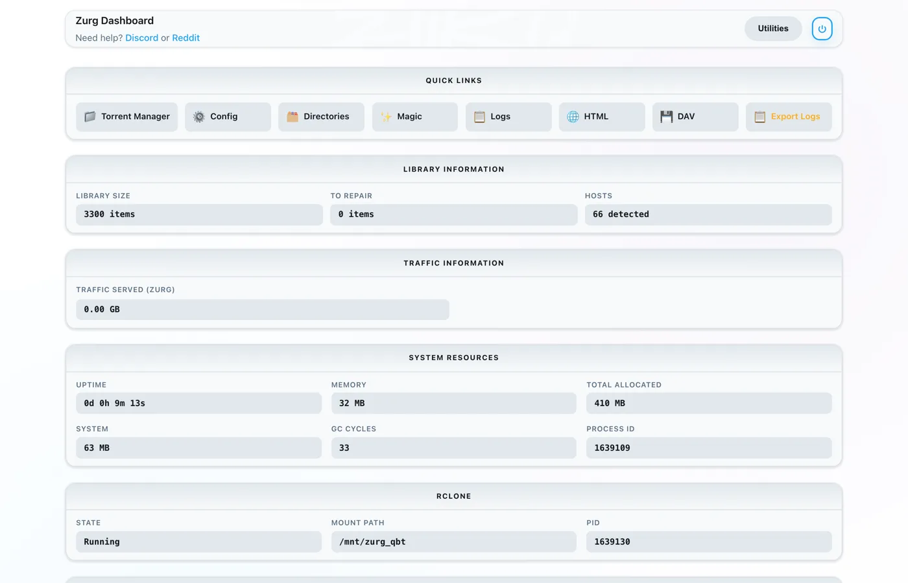

**Config** is where the setting lives; **Magic** is where you will watch grabs arrive later.

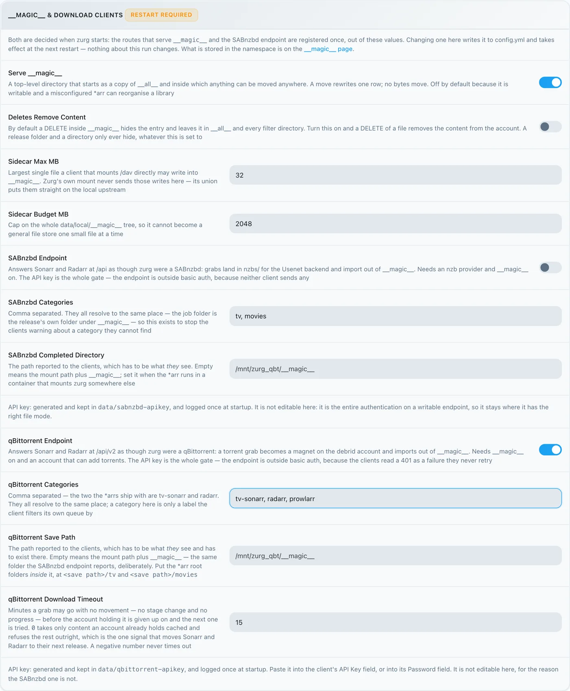

Leave **qBittorrent Save Path** empty unless your \*arr mounts zurg somewhere other than zurg does — see [step 8](#8-if-your-arr-is-in-docker). The orange **Restart Required** chip is telling the truth: nothing here takes effect until zurg restarts.

### Option B — `config.yml`

Add the block by hand and restart zurg.

```yaml
magic:
  enabled: true

qbittorrent:
  enabled: true
  api_key: ""                   # empty = zurg generates one and keeps it
  categories: [tv-sonarr, radarr]
  save_path: ""                 # empty = <mount_path>/__magic__
  download_timeout_mins: 15     # 0 accepts only cached content, negative never gives up
```

**The categories are not folders.** They all resolve to the same place — the release's own folder under `__magic__`. The list exists only so a client stops warning about a category it cannot find. If Sonarr's category is `tv-sonarr`, `tv-sonarr` must be in this list. Prowlarr, if you use it, wants `prowlarr` — see [step 10](#10-prowlarr-manual-grabs).

Restart zurg, then confirm the endpoint registered and the provider took:

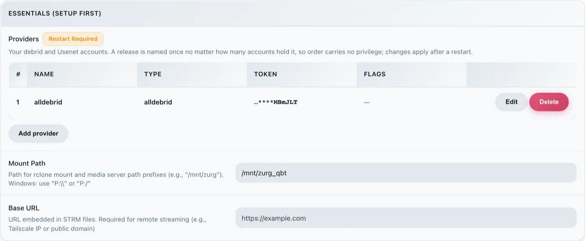

One `alldebrid` row is all the endpoint needs — any of the three torrent-capable types.

The startup log says the same two things, and it is worth reading them once:

```
INFO  router.qbittorrent  qBittorrent API on /api/v2 and /qbittorrent/api/v2, save path /mnt/zurg_qbt/__magic__, categories tv-sonarr, radarr
INFO  router.qbittorrent  qBittorrent: torrents are offered to alldebrid, in that order
```

## 2. Find the API key

The API key is the entire authentication on this endpoint, so get it right once and don't paste it anywhere public.

**If you left `api_key` empty**, zurg generated one on first start, wrote it to `data/qbittorrent-apikey`, and logged it once:

```bash
$ cat data/qbittorrent-apikey
d09abba6e81524618e2d43a3748af385

$ journalctl -u zurg | grep 'generated API key'
qBittorrent: generated API key d09abba6e8… — paste it into Sonarr or Radarr's
API Key field, or pin it as qbittorrent.api_key in config.yml
```

Illustrative key — yours will differ. The file survives restarts, so the key is stable once generated.

**If you set `api_key` yourself**, it is in `config.yml` and no file is written.

**This endpoint is outside zurg's basic auth.** The \*arrs authenticate to a download client the download client's own way, and their HTTP layer turns a basic-auth 401 into "unable to connect" with nothing actionable in it — so zurg deliberately exempts `/api/v2`. The API key is the whole gate. Treat the port the way you treat the rest of zurg's: on a trusted network, or behind something that is.

Three ways to present the key, all accepted:

- **`Authorization: Bearer <key>`** — what the client sends when its **API Key** field is filled in. This is the recommended one; it skips the login entirely.
- **The key as the password** on `auth/login`, with any username. Use this if you would rather fill in Username and Password.
- **zurg's own dashboard username and password**, if `username:` and `password:` are set in `config.yml`.

## 3. Prove it answers

Do this before touching Sonarr. Ten seconds, and it separates "zurg is wrong" from "the \*arr is wrong" for the rest of the setup.

```bash
$ KEY=d09abba6e81524618e2d43a3748af385
$ ZURG=192.168.88.244:9995

$ curl -s "http://$ZURG/api/v2/app/webapiVersion"
Forbidden

$ curl -s -H "Authorization: Bearer $KEY" "http://$ZURG/api/v2/app/webapiVersion"
2.11.2

$ curl -s -H "Authorization: Bearer $KEY" "http://$ZURG/api/v2/app/version"
v5.0.4

$ curl -s -H "Authorization: Bearer $KEY" "http://$ZURG/api/v2/app/preferences" | jq .save_path
"/mnt/zurg_qbt/__magic__"
```

**The bare `Forbidden` is the healthy answer.** The clients' first probe is an *unauthenticated* `GET /api/v2/app/webapiVersion`, and real qBittorrent answers it `403` when the API is there but nobody is logged in — so that is what zurg answers, and the client reads it as "v2 supported, authenticate now". A plain **404** instead means `qbittorrent.enabled` is still false or zurg has not been restarted since you changed it.

Then check that a wrong key is actually refused:

```bash
$ curl -s -o /dev/null -w "%{http_code}\n" -H "Authorization: Bearer wrongkey" \
    "http://$ZURG/api/v2/torrents/info"
403
```

`save_path` is the path zurg will hand the clients — check now that it is a path *they* can open.

Both URL shapes work, so either is fine in the client's **URL Base** field:

| Path | URL Base in Sonarr / Radarr | Answers |
|---|---|---|
| `/api/v2/…` | *(leave empty)* | yes |
| `/qbittorrent/api/v2/…` | `/qbittorrent` | yes |

## 4. Make the root folders

Make them before you add them, because the \*arr's Add Root Folder dialog browses the live filesystem and will not offer a folder that does not exist.

```bash
$ mkdir -p /mnt/zurg_qbt/__magic__/tv /mnt/zurg_qbt/__magic__/movies

$ ls -d /mnt/zurg_qbt/__magic__/tv /mnt/zurg_qbt/__magic__/movies
/mnt/zurg_qbt/__magic__/movies
/mnt/zurg_qbt/__magic__/tv
```

Substitute your own `mount_path` for `/mnt/zurg_qbt`.

**The root folder must be inside `__magic__`, not at it and not above it** — the same rule as the Usenet walkthrough, for the same reason: both clients raise a health check when a root folder *is* the download client's output folder, Radarr also raises one when a root folder *contains* it, and a root folder one level inside is the one arrangement neither complains about. [That guide](sonarr-radarr.md#4-make-the-root-folders) has the screenshots of getting it wrong.

There is a second reason that is specific to torrents: a move whose destination is outside `__magic__` is a move between two filesystems, which is a copy — and a copy off a debrid mount reads the whole release back over the network. `Remove Completed` staying on (below) keeps the import a rename; a root folder outside the namespace would undo that anyway.

## 5. Add the client in Sonarr

A brand-new Sonarr blocks everything behind a first-run screen. Pick **Forms (Login Page)**, set a username and password, and click **Save**.

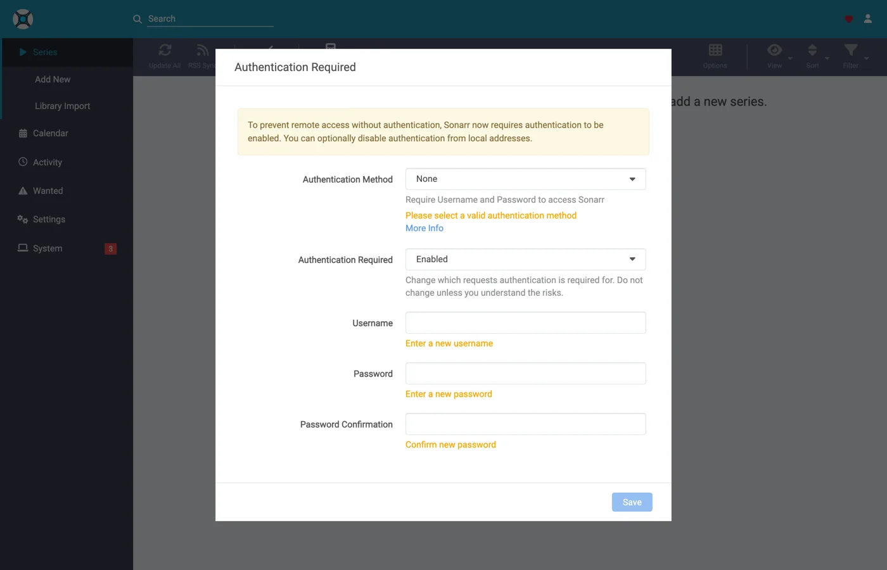

It will not let you past until **Authentication Method** is something other than None.

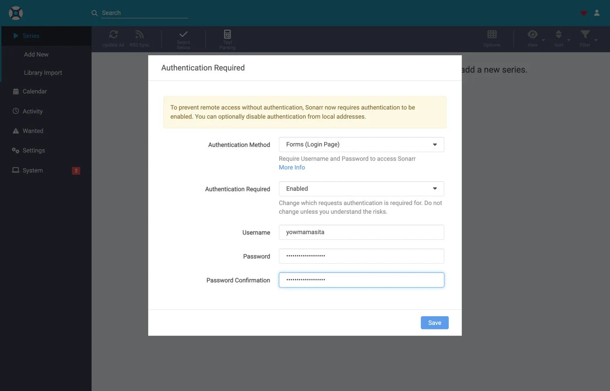

After Save you are signed out once and land on the login page.


### Settings → Download Clients

Go to **Settings → Download Clients**. On a fresh install there is nothing here but the **+** card.


Click the **+** under "Download Clients" — not the one further down under "Remote Path Mappings".

Choose **qBittorrent** from the **Torrents** column.

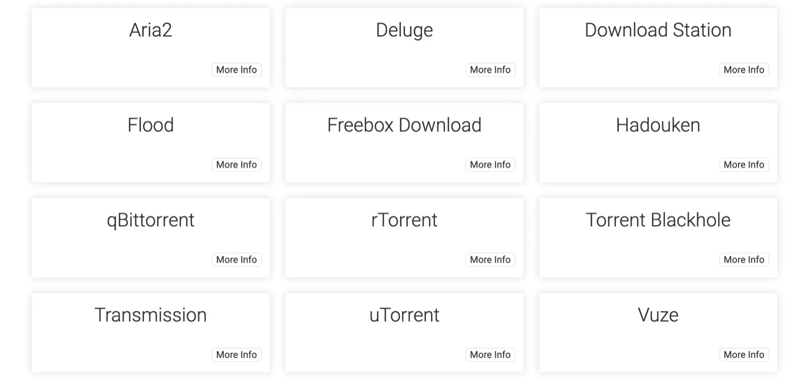

zurg impersonates qBittorrent specifically, so nothing else in this list will work. The two columns are the give-away for which guide you are following: SABnzbd sits under Usenet, qBittorrent under Torrents.

The dialog opens with qBittorrent's own defaults — `localhost`, port `8080`, no key.

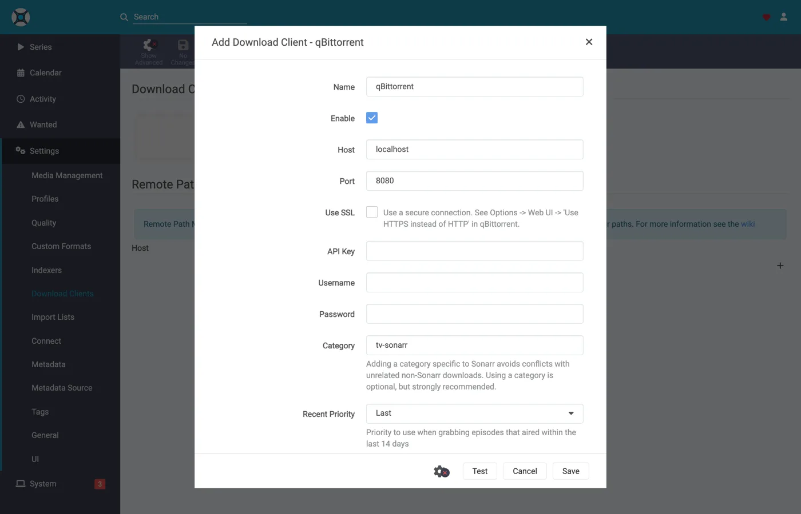

### What to put in each field

| Field | Value | Why |
|---|---|---|
| Name | `zurg (torrents)` | Anything. It is only a label. |
| Enable | on | Leave it checked. |
| Host | `192.168.88.244` | The host zurg runs on, as *the \*arr* can reach it. In Docker, see the warning below. |
| Port | `9995` | zurg's normal port — `9999` on a default install. |
| Use SSL | off | Only if you put zurg behind TLS yourself. |
| URL Base | empty | `/qbittorrent` also works — see step 3. |
| API Key | from step 2 | The whole gate. Sent as a bearer token. |
| Username / Password | empty | Leave both empty — the key replaces them. |
| Category | `tv-sonarr` | Must appear in `qbittorrent.categories`. The \*arr default, so it already does. |
| Initial State / Sequential / First-Last | defaults | There is no swarm here; none of these do anything. |
| **Remove Completed** | **on** | **The one that matters** — see below. |

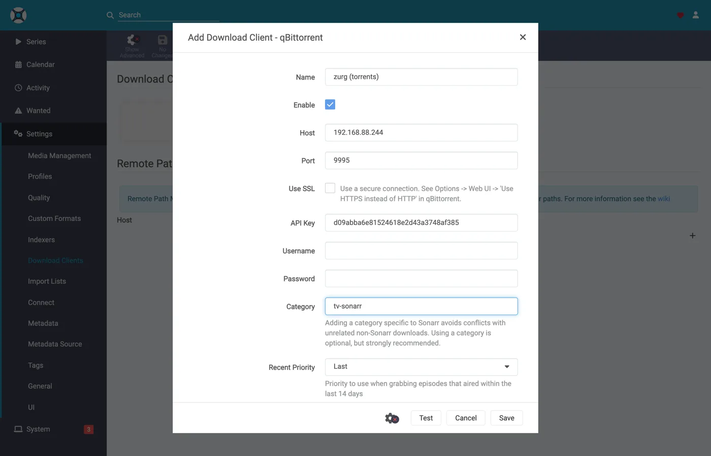

The API key shown is illustrative — paste your own.

**In Docker, "localhost" and the hostname both lie.** Inside a container, `localhost` is the container, and the machine's own hostname usually resolves to `127.0.1.1` — which is also the container. This rig's host is called `zurg-server`, and `zurg-server` inside the Sonarr container resolved to `127.0.1.1` while the very same name worked from the host shell. Use the host's **LAN or Tailscale IP**, never `localhost` and never the bare hostname.

Click **Test**. A green tick means the client's checks passed — API version, authentication, the category and the torrent list.

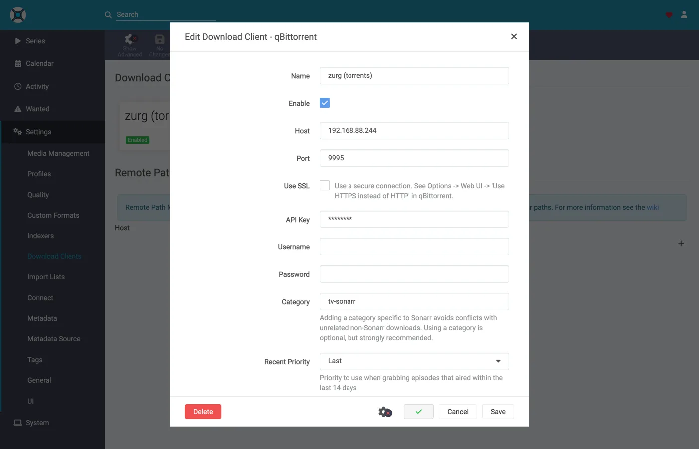

Now click **Save**.

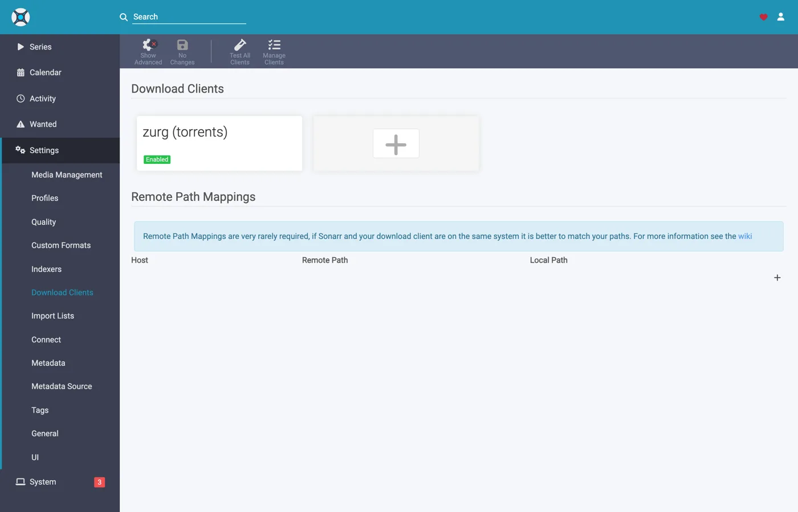

## 6. Add the root folder in Sonarr

Go to **Settings → Media Management** and scroll to the bottom.

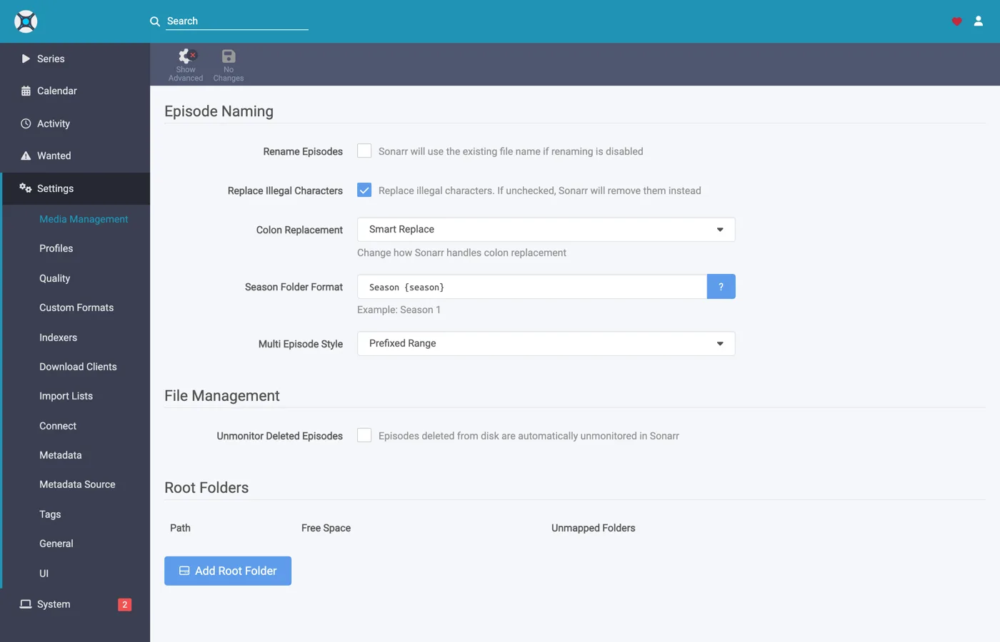

Click **Add Root Folder**. A file browser opens on the container's filesystem.

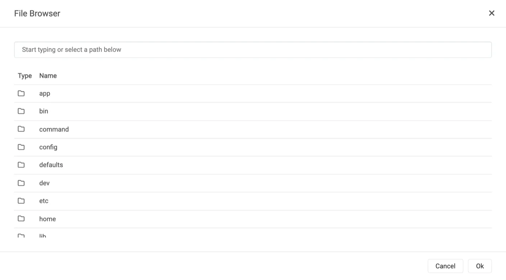

Type or navigate. If the mount is genuinely visible to Sonarr, `__magic__` opens and shows what you made in step 4 — the fastest proof you will get that the bind mount is correct.

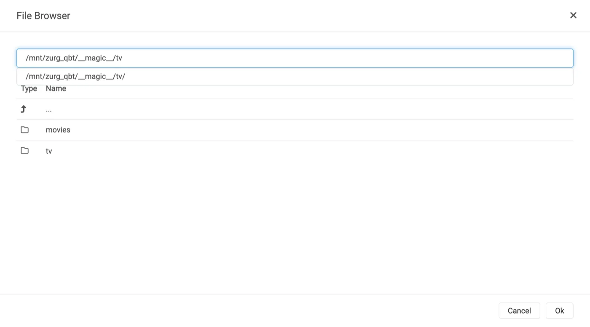

If this is empty or errors, stop and fix the mount before going further.

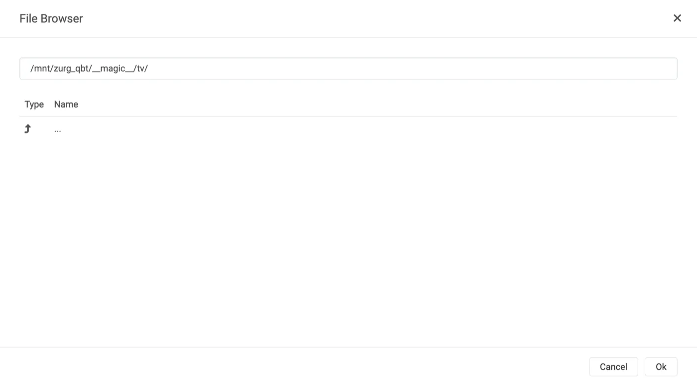

Finish the path at `__magic__/tv` and click **Ok**.

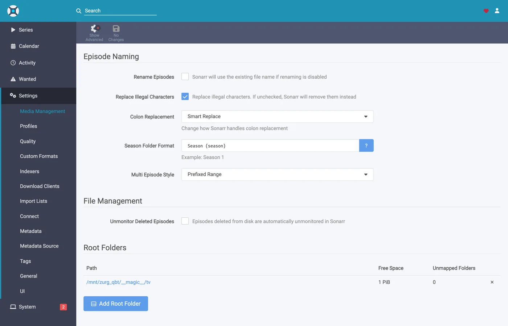

**Free Space** reading `1 PiB` is zurg reporting a virtual filesystem, not a disk — that is expected, and it is what satisfies the \*arr's free-space check before a grab.

## 7. Do the same in Radarr

Identical, with two values changed: the category is `radarr` and the root folder is `__magic__/movies`.

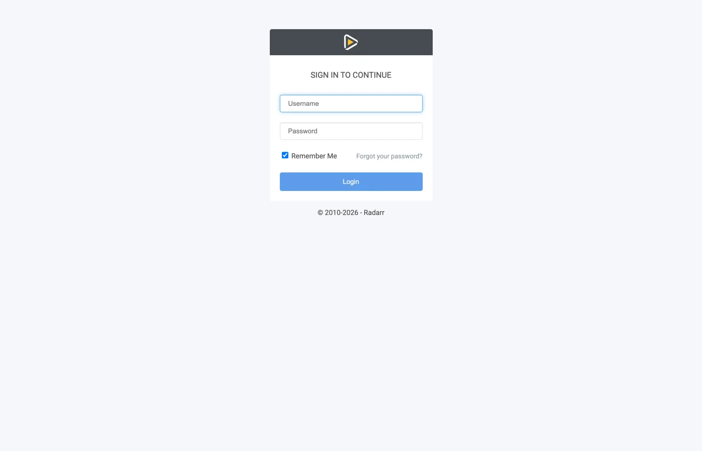

Radarr's first run works the same way — set Forms auth, then sign in.


**Settings → Download Clients → +**, then **qBittorrent** under Torrents.

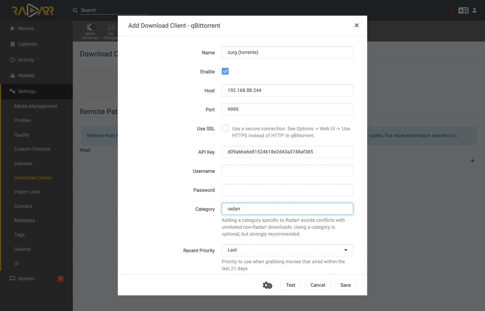

Same host, same port, same key. Only **Category** differs — `radarr`, not `tv-sonarr`.

**Test**, green tick, **Save**.

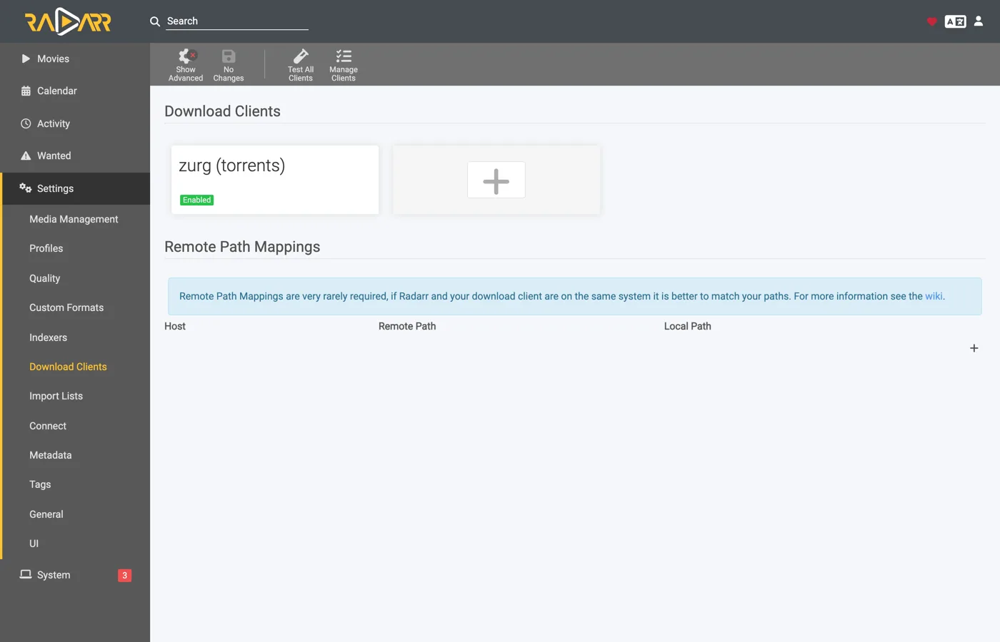

Then **Settings → Media Management → Root Folders → Add Root Folder**, and add `/mnt/zurg_qbt/__magic__/movies`.

**One zurg, two clients, one queue.** The torrent list each client sees is filtered by category and nothing else. Two Sonarrs both using `tv-sonarr` will see each other's grabs; Sonarr on `tv-sonarr` and Radarr on `radarr` will not. Keep one client per category and this never comes up.

## 8. If your \*arr is in Docker

The same two problems as the Usenet walkthrough, with the same fixes — the mount is the mount — so this is the short version. [That guide's step 8](sonarr-radarr.md#8-if-your-arr-is-in-docker) has the detail.

**The path zurg reports must be a path the client can open.** If the container mounts the library somewhere other than zurg does, every import fails with *download doesn't contain intermediate path* or a remote-path health check. Set `qbittorrent.save_path` to the path *the client* sees, or add a remote path mapping:

```yaml
qbittorrent:
  save_path: "/data/zurg/__magic__"   # what the *arr sees, not what zurg sees
```

**Bind the mount's parent, not the mountpoint.** Restarting zurg unmounts and remounts; a container that bound the mountpoint itself keeps the dead fuse connection and every read after that answers `Socket not connected` — and because both clients check free space before a grab, *every release is silently rejected*. Bind the parent with `rslave` and the remount arrives as a sub-mount event the container follows. This rig's containers were started before zurg ever mounted, and the mount still appeared inside them:

```bash
$ docker exec sonarr df -h /mnt/zurg_qbt
Filesystem      Size  Used Avail Use% Mounted on
zurg{8amax}:    1.0P     0  1.0P   0% /mnt/zurg_qbt
```

## 9. Watch one grab go through

Add one thing, grab it by hand, and follow it the whole way. Everything below is a real grab through the setup above: *Ghost in the Shell (1995)*, grabbed from an indexer by hand.

### Grab it

Open the movie, click **Interactive Search**, and pick a release.

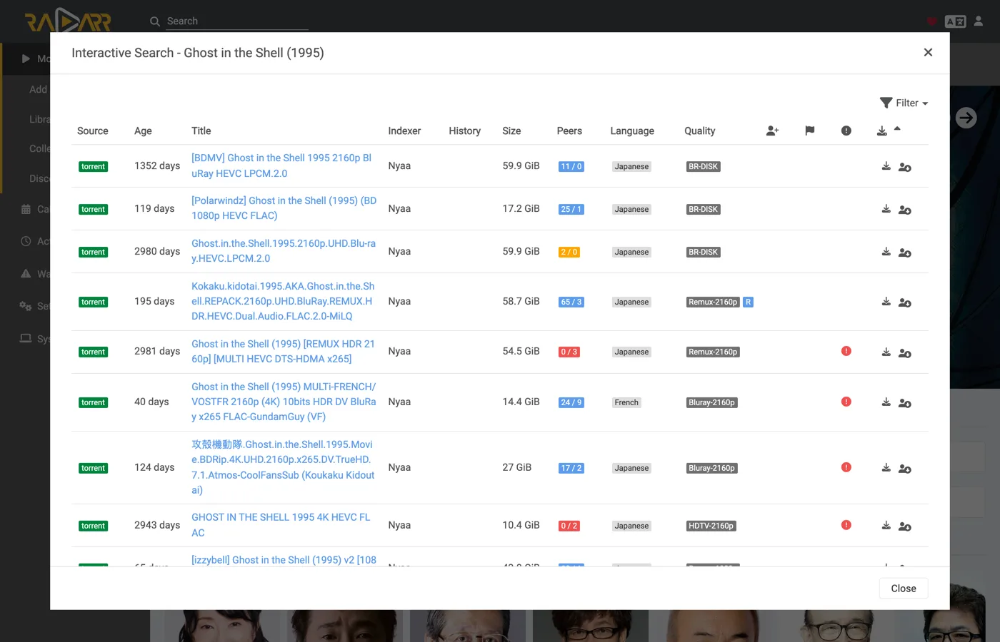

The **Source** column reads `torrent` — that is the protocol this endpoint takes. Click the circled-arrow button at the end of the row to grab it. If the client wants you to confirm the mapping first:

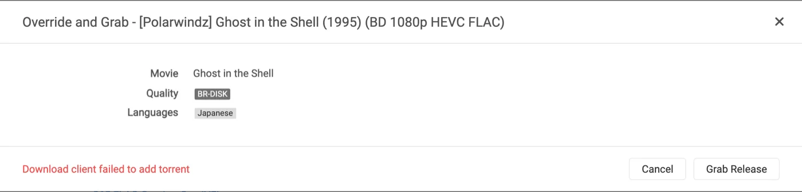

**Override and Grab** appears when the release does not match cleanly. Check the mapping and click **Grab Release**. A normal grab never shows this.

### The account takes it

Two lines in zurg's log, and they are the whole add:

```
INFO  router.qbittorrent  qBittorrent: [Polarwindz] Ghost in the Shell (1995) (BD 1080p HEVC FLAC) (0c5e4077…) added to alldebrid as 720824192
INFO  router.qbittorrent  qBittorrent: [Polarwindz] Ghost in the Shell (1995) (BD 1080p HEVC FLAC) (0c5e4077…) finished on alldebrid
```

The hash is the info hash the client sent. `added … as 720824192` is the account's own id for it. This release was already cached on the account, so `finished` follows in about a second — an uncached one sits between the two lines while the account downloads it, and what the account is doing in that gap is what the client's queue shows:

| What the account is doing | Queue shows |
|---|---|
| Working out what the magnet refers to | *Loading metadata*, nothing measured yet |
| Parked in the account's own queue | *Queued* |
| Downloading — the rate, the swarm and the time left are the account's own figures | *Downloading*, with a real progress bar |
| Every account has refused or timed out | A **warning**, with the reason — see [Troubleshooting](#troubleshooting) |
| In the library, folder ready to import | *Completed* |

A stalled swarm reports **Downloading** with the rate and the seed count at zero rather than as a stall warning — `stalledDL` is a state the \*arrs act on for their failed-download handling, and a swarm with no seeds is not a verdict on the release.

### The import happens

**Activity → Queue**, then **Activity → History**. Two events, seconds apart — **Grabbed**, then **Movie Imported**:

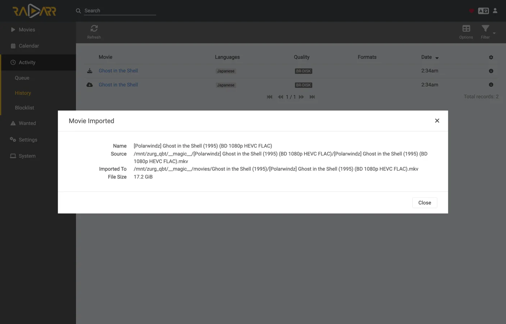

Expand the imported row and read the paths. **Source** is `/mnt/zurg_qbt/__magic__/[Polarwindz] …/[Polarwindz] ….mkv` and **Imported To** is `/mnt/zurg_qbt/__magic__/movies/Ghost in the Shell (1995)/…` — the file never left `__magic__`, which is what makes the import a rename.

A grab the client decides not to import stays in the queue as a warning instead. The one in this screenshot's queue row is an upgrade the quality profile refused — visible, one click from *Remove*, and clearing nothing by itself:

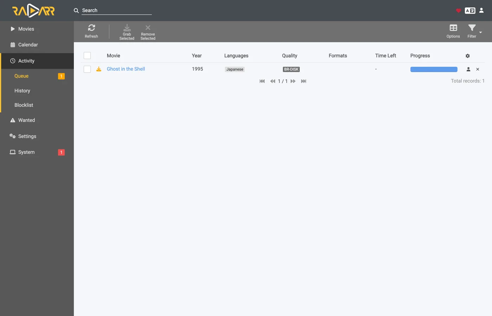

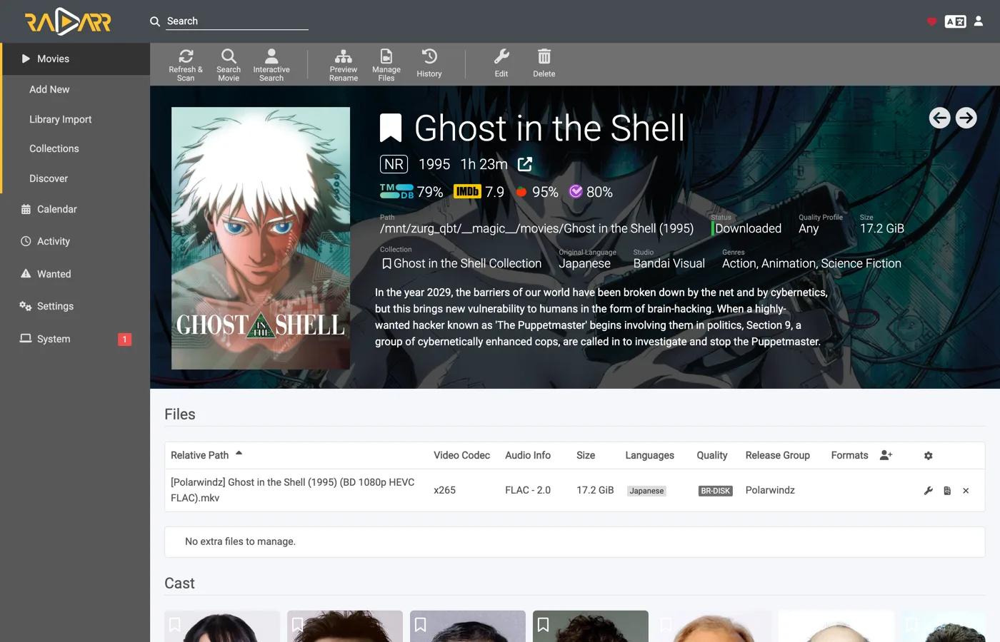

**Status: Downloaded, Size 17.2 GiB** — and nothing was downloaded to make that true. The bytes are read off the account when something plays the file.

### Prove the file is real

The import moved the file into the root folder. Read both ends of one and ask ffprobe what it is:

```bash
$ F="/mnt/zurg_qbt/__magic__/tv/One Piece/Season 23/[AnoZu] One Piece S23E21 1080p CR WEB-DL AAC 2.0 H.264.mkv"

$ ls -la "$F"
-rw-rw-r-- 1 yowmamasita users 1446325722 Aug 31 00:44 …mkv

$ dd if="$F" bs=1M count=1 >/dev/null
1048576 bytes (1.0 MB, 1.0 MiB) copied, 0.00592934 s, 177 MB/s

$ ffprobe -v error -show_entries format=duration,size,format_name \
    -of default=noprint_wrappers=1 "$F"
format_name=matroska,webm
duration=1415.808000
size=1446325722
```

That one is a Sonarr grab — an episode pulled the same way, imported into `tv/One Piece/Season 23/`. A 23-minute Matroska, read straight off the debrid account. The bytes arrive when something reads them, not when the \*arr imports.

### From Sonarr, it looks the same

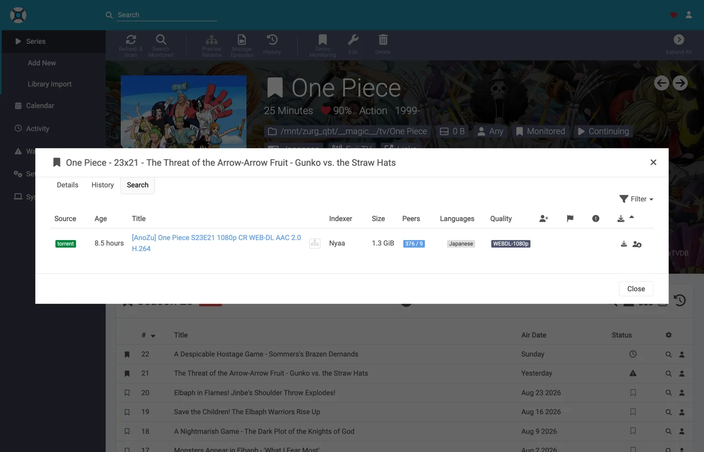

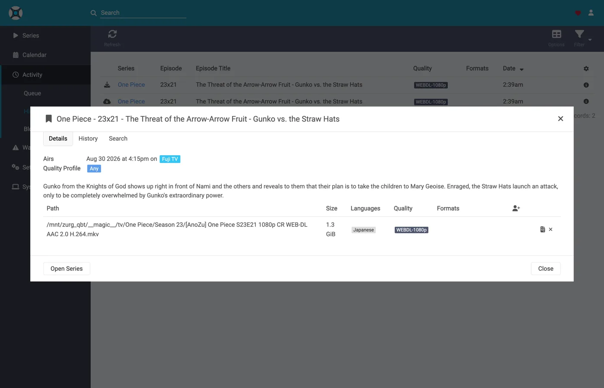

The same two history events, the same import-by-rename, and a queue that empties the moment the import lands — a cached release goes from grab to imported in a handful of seconds, which is why there is no mid-download screenshot of it here.

## 10. Prowlarr, manual grabs

Prowlarr speaks to the same endpoint — it shares the qBittorrent client code with the other two — but it is not an importer. It has no library and never imports anything; what it can do is **push a release to the account by hand**, which is exactly what its download client is for.

Prowlarr's first run is the same Forms-auth screen as the other two.

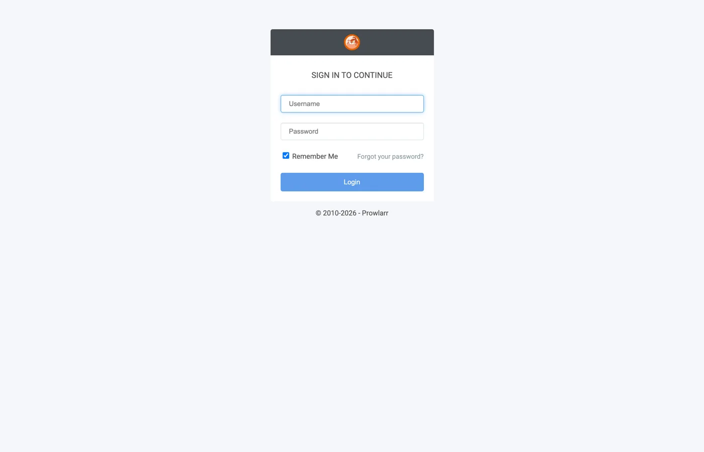

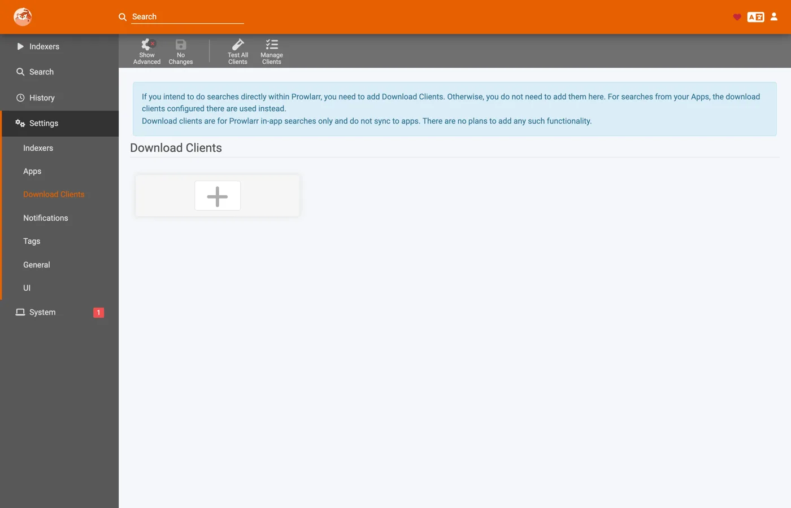

**Settings → Download Clients → +**, then **qBittorrent** — in Prowlarr's picker every client sits in one alphabetical list rather than the two columns the \*arrs use. Same host, port and API key. Two fields differ from the \*arrs:


| Field | Value | Why |
|---|---|---|
| Default Category | `prowlarr` | Prowlarr's own default, and its help text is worth reading: *adding a category specific to Prowlarr avoids conflicts with unrelated non-Prowlarr downloads*. Add `prowlarr` to `qbittorrent.categories` and restart zurg, or the connection test warns about a category it cannot find. |
| Priority | `Last` | Nothing to apply it to. |

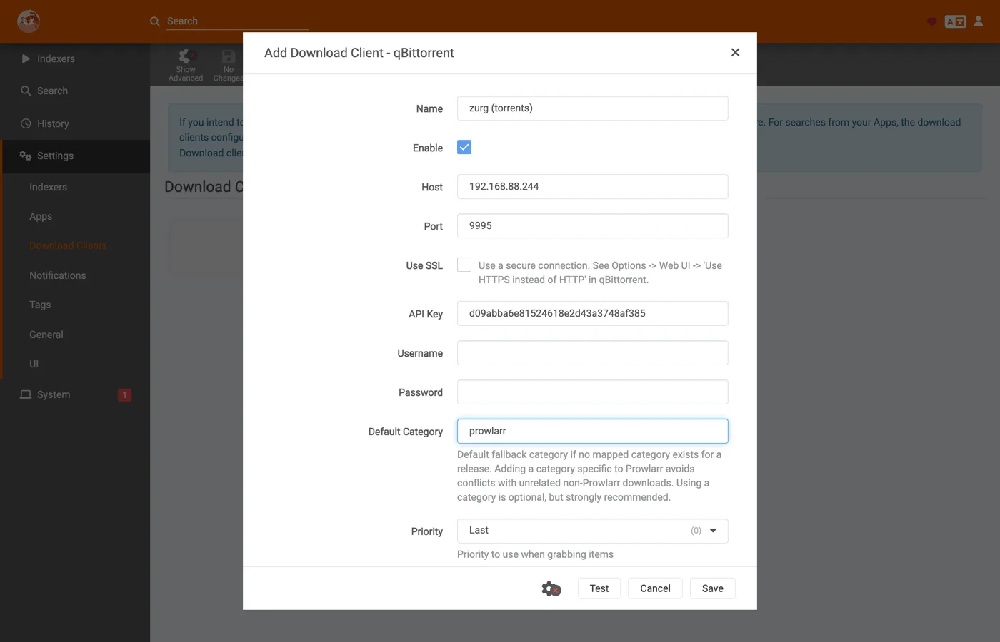

**Test**, green tick, **Save**.


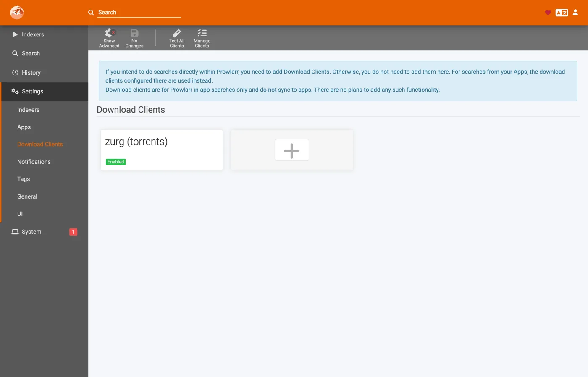

Then **Search**, type what you want, and push a row at the client:

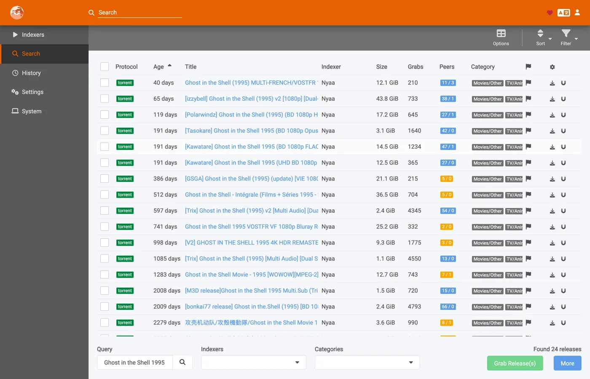

The release goes onto the account exactly as an \*arr grab does — same add path, same categories, same `__magic__` folder — and this one landed cached, `finished` inside a second. But nothing imports it. It sits in the account and serves from the mount, which is the point: Prowlarr's push is for *put this on my debrid account now*, not for the automated grab-import-clean pipeline. For that, keep Sonarr and Radarr pointed at the endpoint and let Prowlarr manage indexers.

## Timeouts, and cached-only mode

A grab that stops moving comes off the account it is on and is offered to the next. One key decides it:

```yaml
qbittorrent:
  download_timeout_mins: 15
```

| Value | What it does |
|---|---|
| `15` | The default. Fifteen minutes with no movement — no stage change, no rise in progress — and the account is given up on. |
| `0` | Cached-only. A grab is accepted only onto an account that already holds the content, and refused inside the add otherwise. |
| negative | Never give up. The grab stays on the first account that took it. |

**What counts as moving** is a change of stage or a rise in progress, judged on the raw fraction the account reports rather than whole percent — one percent of a 100 GB release is a gigabyte. A release the account is unpacking is exempt from the clock: that stage sits at one figure for as long as it takes.

**Fifteen is measured, not chosen.** AllDebrid parks a healthy job in its own queue with every counter at zero; in the measurements behind the default, two runs out of two sat there for 580 and 622 seconds before downloading in seconds and finishing. A ten-minute default would have abandoned both.

**The whole add is budgeted at 75 seconds.** The \*arrs cancel a `torrents/add` at 100 seconds and report the expiry as a connection failure, with no way to raise it. Every account shares the one deadline, so three accounts fit comfortably and a fourth gets whatever the first three did not spend.

**Cached-only mode** is the one worth knowing as a policy choice: the refusal happens inside the add, synchronously, and a synchronous refusal is the only signal the \*arrs act on — they fail the grab and move to the next release in the list. Everything after the add reaches them as a warning about a download in progress, which they wait on. Set `download_timeout_mins: 0` and an uncached release is rejected on the spot instead of being downloaded.

## What works, and what does not

Works:

- The connection test in all three clients — API version, authentication, the category and the torrent list.
- Grabbing, queue, history, import by rename, and the post-import cleanup, in Sonarr and Radarr.
- Re-grabbing a release the account already holds. The \*arr gets the finished torrent back and imports it; the account keeps one copy.
- Multiple accounts: a grab is offered to each in the order of `providers:`, and a refusal or a stall moves to the next.
- Pushing a release by hand from Prowlarr.

Does not:

- **The qBittorrent Web UI.** This is the API only; there is no page to open.
- **Seeding, queueing and priorities.** There is no swarm. Pause, force-start, reprioritise, recheck, relocate and share limits are accepted and do nothing.
- **Failure as a first-class state.** qBittorrent's API has no way to say a download failed, so a release no account would take reaches the \*arr as a *warning*, never as a blocklist entry. It is visible in the queue with the reason attached, one click from *Remove → Blocklist and Search*, but it does not clear itself and nothing re-grabs unattended. This is the real difference from the SABnzbd endpoint, which can report a failed job and have the client react.
- **Adding by plain HTTP URL.** `torrents/add` takes magnets and uploaded `.torrent` files. Both \*arrs send one of those; a bare `http://…/x.torrent` is refused.
- **Basic auth on the endpoint.** The API key is the only gate.

**Blocked release names, Real-Debrid only.** RD refuses some releases on the filename alone — `WEB-DL`, the rip family, a source tag dot-adjacent to an old codec. zurg knows the patterns and refuses such a grab immediately rather than spending an add slot and a minute of retries on a refusal that was certain; the client fails that grab and takes the next release, which is what you want. On TorBox and AllDebrid the same release is added normally.

## Troubleshooting

| What the \*arr says | What it means |
|---|---|
| "Unable to connect to qBittorrent" | zurg is not reachable at that host and port, or something in front of it answered a non-200. Check `qbittorrent.enabled` — while it is off, `/api/v2` is a plain 404. In Docker, check you did not use `localhost` or the bare hostname. |
| Test passes, grabs fail with *Download client failed to add torrent* | The client reached zurg and zurg refused the add. zurg logs every refusal — grep the log for `qBittorrent: refusing`. The line names the reason and every account it was tried on. |
| `every account that takes torrents refused or timed out` in zurg's log | No account would take the release. If it names a rate limit where you expected a healthy account, count the *other* zurg instances on the same token: this rig's first grab failed exactly that way while a second zurg on the same Real-Debrid account was walking a large library and the two were sharing one API budget. |
| "Category … does not exist" | The category in the client is not in `qbittorrent.categories`. Add it and restart zurg. |
| A grab sits *Downloading* for a long time | The account is genuinely downloading it. The queue carries the account's own rate and time left where it gives them; a release with no seeds reads as zero on both, which is not an error. |
| A completed release sits in the queue as a warning | Either the client decided not to import it (an upgrade the profile refuses), or every account refused it. The queue row carries the reason. It clears nothing by itself — remove it by hand, and *Blocklist and Search* if the release is bad. |
| "Downloads in root folder" / "Remote path mapping" | The same root-folder and path rules as the Usenet endpoint — see [steps 4](#4-make-the-root-folders) and [8](#8-if-your-arr-is-in-docker). |
| Every release rejected, nothing in the log | A stale bind mount. Run `docker exec <client> df -h <mount>`; if it says `Socket not connected`, bind the parent with `rslave` and recreate the container. |

## Where the state lives

| Path | What it is |
|---|---|
| `data/qbittorrent-apikey` | A generated API key. Not written when `qbittorrent.api_key` is set. |
| `data/qbittorrent-jobs.json` | The jobs the clients have handed the endpoint — which account holds each, under which category, and every account already tried. |
| `data/magic.json` | The `__magic__` table — every placement and tombstone the imports created. |

The `__magic__` page on zurg's dashboard shows the results of the imports: placements are files the clients moved, tombstones are the job folders they deleted afterwards, and the releases the endpoint took are listed as rows against the folders they were imported out of.

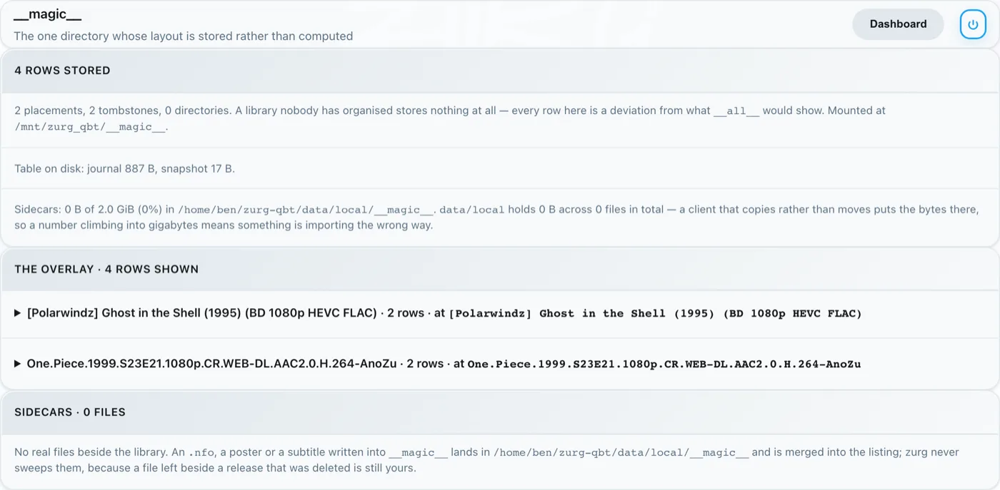

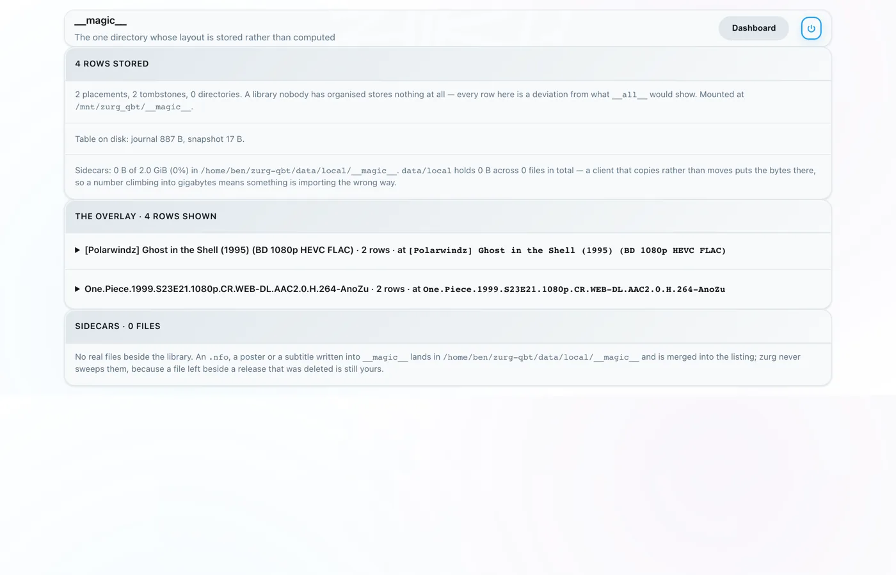

The [reference](../reference/config.md#qbittorrent-the-torrent-download-client-sonarr-and-radarr-see) has every `qbittorrent:` key, and [the client contract](../internals/qbittorrent-client-contract.md) — written against the Sonarr and Radarr source — is the specification the endpoint answers to, with the file and line of every claim.
