# Windows, the binary, from scratch

No Docker, no WSL: the zurg `.exe` in a folder, a `config.yml` you write once, and a `Z:` drive in Explorer. This page walks the whole thing in two passes — first **RealDebrid with the qBittorrent endpoint**, then a full reset and **Usenet with the SABnzbd endpoint** — because those are the two installs people actually make, and they exercise different halves of zurg.

Everything below was captured on a live install: Windows 11 Pro 23H2 (build 22631), PowerShell 5.1, WinFsp 2.0.23075, zurg `2026.08.30.0459-nightly-73-g5b4c9790`, and a Real-Debrid account plus a Usenet news account. User names have been changed; API keys and credentials shown are illustrative.

## What you need

- **zurg.exe** — from the [sponsor releases](https://github.com/debridmediamanager/zurg/releases). This page assumes you have downloaded it.
- **WinFsp** — zurg mounts the library through rclone, and rclone needs WinFsp for a drive letter on Windows. Install it silently, or from the [installer](https://github.com/winfsp/winfsp/releases):

  ```powershell
  $url = "https://github.com/winfsp/winfsp/releases/download/v2.0/winfsp-2.0.23075.msi"
  Invoke-WebRequest -Uri $url -OutFile "$env:TEMP\winfsp.msi" -UseBasicParsing
  Start-Process msiexec.exe -ArgumentList "/i", "$env:TEMP\winfsp.msi", "/qn", "/norestart" -Wait
  ```

- **An account** — a Real-Debrid API token for the first pass, a news server for the second.

Nothing else. rclone and ffprobe download themselves on first run.

## 1. First run: zurg builds its own home

Make a folder, put the binary in it, run it once with no config file:

```powershell
PS C:\Users\yowmamasita> mkdir C:\Users\yowmamasita\zurg
PS C:\Users\yowmamasita\zurg> .\zurg.exe
```

zurg creates a default config, fetches its two helper binaries, tells you what to do next, and exits:

```
INFO  setup  Config file not found, creating default from config.simple.yml
INFO  setup  ffprobe: bin\ffprobe.exe (from github.com/eugeneware/ffmpeg-static)
INFO  setup  rclone: bin\rclone.exe (from downloads.rclone.org)
INFO  zurg   Default config created at config.yml
INFO  zurg   Update config.yml with your Real-Debrid token, then rerun zurg.
```

The downloads are one-time and land in `bin\` — about 85 MB each. After this first run the folder looks like:

```
C:\Users\yowmamasita\zurg\
├── bin\                ffprobe.exe, rclone.exe
├── data\               library cache, keys, the __magic__ table
├── dump\
├── logs\               zurg.log, rclone.log
├── nzbs\               the Usenet watch directory (second pass)
├── strm\
├── config.yml
└── zurg.exe
```

The generated `config.yml` is a minimal one — a placeholder Real-Debrid provider and two directory filters. You replace it with the config for whichever pass you are doing.

## 2. The RealDebrid pass

### The config

Overwrite `config.yml` with this — a Real-Debrid token, the qBittorrent endpoint on, and the mount as `Z:`:

```yaml
zurg: v1
providers:
  - type: realdebrid
    token: YOUR_RD_API_TOKEN

directories:
  shows:
    group: media
    group_order: 10
    filters:
      - has_episodes: true
  movies:
    group: media
    group_order: 20
    only_show_the_biggest_file: true

ffprobe_binary: bin\ffprobe.exe
rclone_binary: bin\rclone.exe

rclone_enabled: true
mount_path: "Z:"
rclone_extra_args:
  - "--links"

magic:
  enabled: true

qbittorrent:
  enabled: true
  api_key: ""          # empty = zurg generates one and keeps it
  categories: [tv-sonarr, radarr]
```

Three Windows specifics in there:

- **`--links` is required.** zurg serves the library as an rclone union of a local and a remote half, and on Windows the union fails without it. Without `--links` the mount logs `symlinks not supported without the --links flag` and serves nothing.
- **`mount_path: "Z:"`** is a drive letter here, not a POSIX path. Any free letter works.
- **Keep `magic.enabled: true`** if you ever want Sonarr or Radarr importing from this machine — an import is a rename inside `__magic__`, and without it every import becomes a full download. The same applies to the Usenet pass below.

### Start it and read the log

Start zurg the plain way for now — a PowerShell window in the folder:

```powershell
PS C:\Users\yowmamasita\zurg> .\zurg.exe --config config.yml
```

The first thing it does is Real-Debrid's network test — it unrestricts test links at every download region and measures latency, taking about twenty seconds. Then the lines that matter:

```
INFO  network_test  Network test completed!
INFO  zurg          Provider realdebrid ready (type=realdebrid)
INFO  router        __magic__ serves sidecar files from data\local\__magic__
INFO  router.qbittorrent  qBittorrent API on /api/v2 and /qbittorrent/api/v2, save path Z:/__magic__, categories tv-sonarr, radarr
INFO  router.qbittorrent  qBittorrent: generated API key 9ec56e41e8c9afa4d5480e1222ad3173 — paste it into Sonarr or Radarr's API Key field, or pin it as qbittorrent.api_key in config.yml
INFO  zurg          Starting server on http://[::]:9999
INFO  rclone        rclone started with mount Z:, union local C:\Users\yowmamasita\zurg\data\local
INFO  zurg          Your realdebrid account will expire in 1858 days
```

The generated key is also in `data\qbittorrent-apikey`. Then the library walk begins — the first start reads every torrent on the account, and on a large account that takes a while (a 3,300-torrent account took roughly 40 minutes here, sharing the provider's API budget with everything else on the account). **While it walks, `__magic__` answers *Library is still loading*** — that is expected, not a fault.

Three warnings you may see, all known and none fatal:

| Warning | What it is |
|---|---|
| `the save path "Z:/__magic__" is not absolute` | A false positive on Windows: zurg checks the path with a POSIX rule, and a drive letter is absolute everywhere else. The endpoint is fine — the clients open `Z:/__magic__` without trouble. |
| `cannot truncate data\magic.journal: Access is denied` | A real Windows quirk, cosmetic in effect: zurg holds the journal open and then tries to compact it, which Windows refuses. Your placements are still written and still survive restarts — verified on this install — the journal just never shrinks. |
| `Debug logging is enabled` | The generated config is verbose by default. Add `log_level: INFO` to quiet it. |

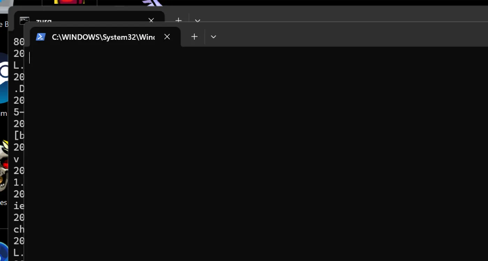

### The dashboard

`http://localhost:9999/` — library size climbing as the walk proceeds, traffic served, memory. The **Quick Links** are the whole UI: Torrent Manager, Config, Directories, Magic, Logs.

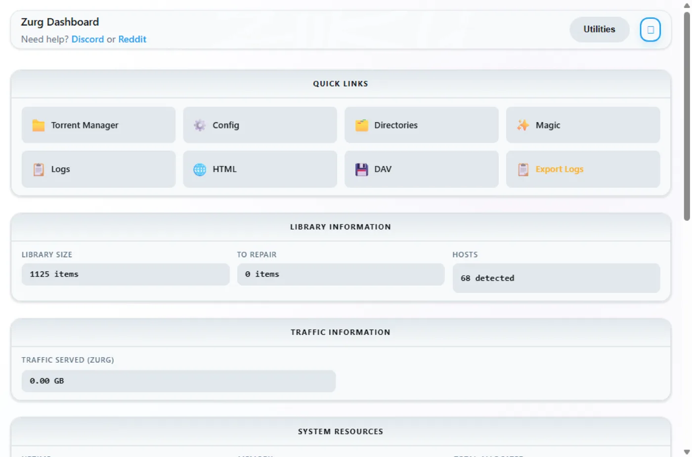

**Config** is where everything lives after the first run. The providers block shows the one account:

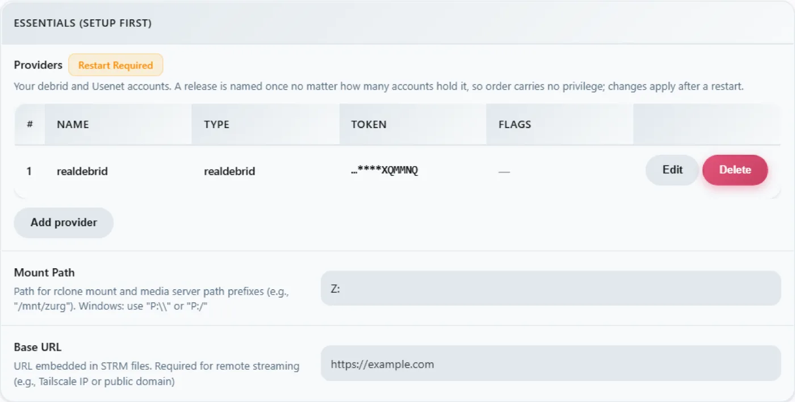

The download-client block — the same toggles you set in `config.yml`, editable here, every change stamped **Restart Required**, which is literal: both endpoints register their routes once at startup.

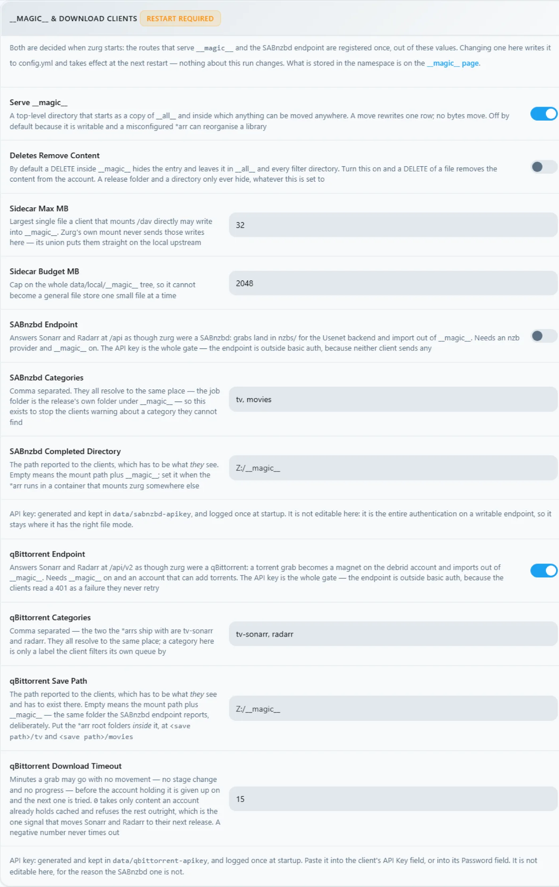

And the mount block, showing the drive letter and the rclone supervision:

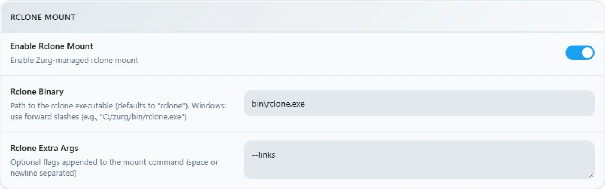

### The Z: drive

When zurg runs, `Z:` is a petabyte-scale filesystem in Explorer:

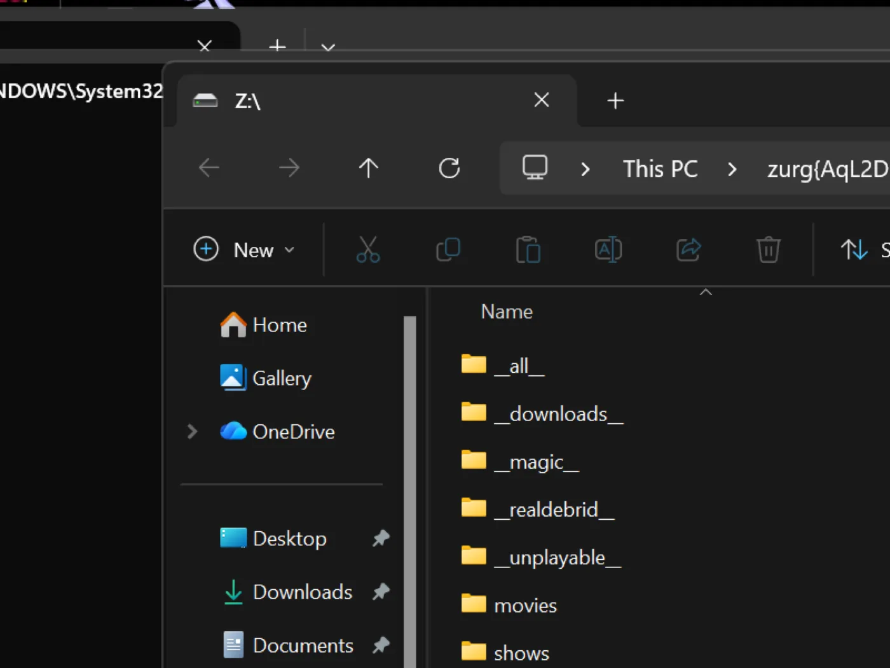

**But only if zurg runs where Explorer can see it — and that is the one genuinely Windows-shaped rule in this setup.** A drive-letter mount belongs to the *logon session* that created it. Start zurg from an SSH connection or from a service and the mount exists, works, and is invisible to your desktop. This is not a bug in WinFsp or rclone; it is how Windows scopes drive letters. [The last section](#keeping-it-running-the-session-rules) has the working recipe — an interactive scheduled task — and what was measured trying the alternatives.

### Prove the qBittorrent endpoint

Same probes as on any platform, from any PowerShell:

```powershell
PS> $KEY = Get-Content data\qbittorrent-apikey
PS> Invoke-WebRequest "http://localhost:9999/api/v2/app/webapiVersion"

# the healthy unauthenticated answer is a 403 — "the API is here, log in"
PS> Invoke-RestMethod "http://localhost:9999/api/v2/app/version" -Headers @{ Authorization = "Bearer $KEY" }
v5.0.4
PS> (Invoke-RestMethod "http://localhost:9999/api/v2/app/preferences" -Headers @{ Authorization = "Bearer $KEY" }).save_path
Z:/__magic__
```

And add a torrent to it. A `.torrent` file goes up with `curl -F`, or any client does it for you:

```
INFO  router.qbittorrent  qBittorrent: added op1176 (dc98af37…) to realdebrid as W7FRRMVJWUOMS
```

The release this install grabbed was not cached on the account, so the \*arr-style queue showed a real download — progress climbing 2% → 10% → 50% → 75% → 99% over about six minutes with the rate Real-Debrid reported — and then:

```
INFO  router.qbittorrent  qBittorrent: op1176 (dc98af37…) finished on realdebrid
```

with the torrent reporting finished and a folder to import from:

```
"content_path": "Z:/__magic__/[NanakoRaws] One Piece S01E1176 (THK TV 1080p HEVC AAC)"
```

Reading the file through `Z:` pulled a megabyte in milliseconds — rclone's VFS read-ahead fronts the provider, so warm reads are local-disk fast and the articles stream in behind them.

One refusal worth knowing: the first release this install tried was named `…WEBRip…`, and Real-Debrid blocks some release names outright. zurg knows the patterns and refuses before spending an add slot:

```
WARN  router.qbittorrent  qBittorrent: realdebrid will not take op1176: it refuses that name outright, so the next account is tried
```

Pick a differently-named release and it goes through. The [torrent walkthrough](../guides/sonarr-radarr-torrents.md) covers the whole endpoint in depth — timeouts, cached-only mode, failure semantics — and the client settings are the same as there, with two Windows notes: **Host** `localhost` when the \*arr runs on the same machine, and the \*arr must run in the same logon session as zurg for it to see `Z:` — see [the session rules](#keeping-it-running-the-session-rules).

## 3. Reset

Switching the install from Real-Debrid to Usenet is a wipe: stop zurg, delete everything the first pass created, keep the binary and `bin\` so the helper downloads do not repeat.

```powershell
PS> Stop-ScheduledTask zurg           # or close the console window
PS> taskkill /IM zurg.exe /F ; taskkill /IM rclone.exe /F
PS> cd C:\Users\yowmamasita\zurg
PS> Get-ChildItem -Exclude zurg.exe, bin | Remove-Item -Recurse -Force
PS> Get-ChildItem

bin
zurg.exe
```

That `Get-ChildItem -Exclude … | Remove-Item` is the whole reset — `config.yml`, `data\`, `logs\`, `nzbs\`, all of it. What survives is exactly what a fresh install needs.

## 4. The Usenet pass

### The config

Same skeleton, different provider — a news account instead of a debrid token, and the SABnzbd endpoint instead of the qBittorrent one:

```yaml
zurg: v1
providers:
  - type: nzb
    nntp:
      host: news.example.usenet.com
      port: 563
      tls: true
      username: YOUR_NEWS_USERNAME
      password: YOUR_NEWS_PASSWORD
      connections: 8

directories:
  shows:
    group: media
    group_order: 10
    filters:
      - has_episodes: true
  movies:
    group: media
    group_order: 20
    only_show_the_biggest_file: true

ffprobe_binary: bin\ffprobe.exe
rclone_binary: bin\rclone.exe

rclone_enabled: true
mount_path: "Z:"
rclone_extra_args:
  - "--links"

magic:
  enabled: true

sabnzbd:
  enabled: true
  api_key: ""          # empty = zurg generates one and keeps it
  categories: [tv, movies]
```

Eight connections is plenty for streaming; the account's plan states its own cap.

### Start it

```powershell
PS C:\Users\yowmamasita\zurg> .\zurg.exe --config config.yml
```

The contrast with the first pass is immediate: no walk. An NZB library starts empty — there is nothing to fetch from anywhere until you put an NZB in it — so startup is the network test, the endpoint lines, and the news connection:

```
INFO  nzb       NZB articles are kept in memory for the life of the process (nzb_segments: resident)
INFO  zurg      Provider nzb ready (type=nzb)
INFO  router    __magic__ serves sidecar files from data\local\__magic__
INFO  router.sabnzbd  SABnzbd API on /api and /sabnzbd/api, completed directory Z:/__magic__, categories tv, movies
INFO  router.sabnzbd  SABnzbd: generated API key b7fb2b17e04244e2d36d0aae2d77b37a — paste it into Sonarr or Radarr, or pin it as sabnzbd.api_key in config.yml
INFO  zurg      Starting server on http://[::]:9999
INFO  rclone    rclone started with mount Z:, union local C:\Users\yowmamasita\zurg\data\local
INFO  zurg      Usenet account nzb connected: nntps://news.frugalusenet.com:563 (8 connections)
```

zurg dials the news server the moment it starts and keeps the connections warm, TLS and all. The SABnzbd key lands in `data\sabnzbd-apikey`.

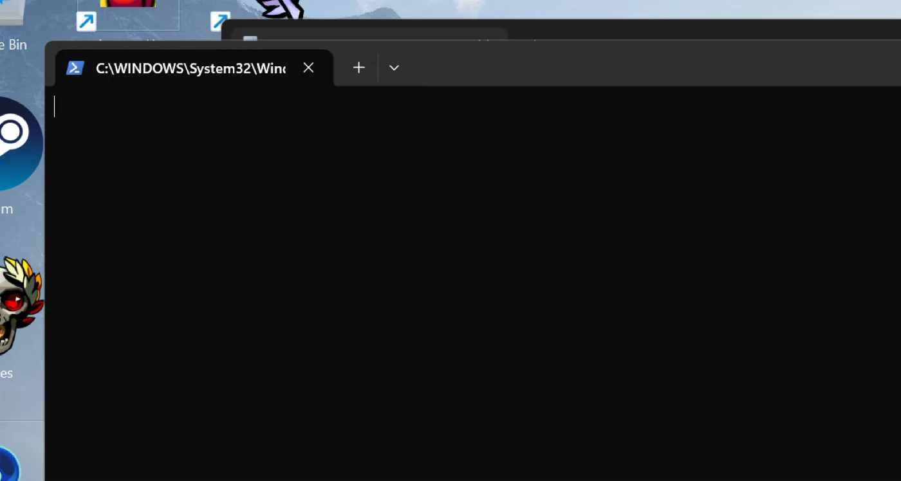

The dashboard now shows a library of nothing, which is correct:

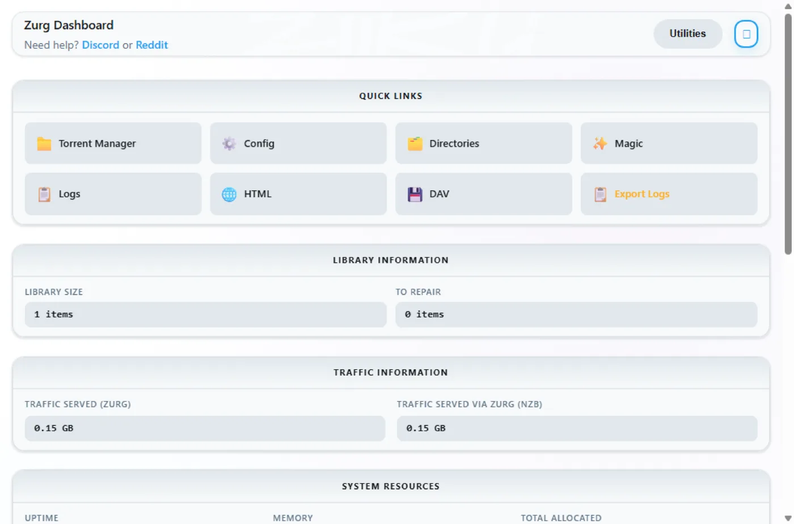

The providers block carries the news account, and the download-client block now shows the SABnzbd half:

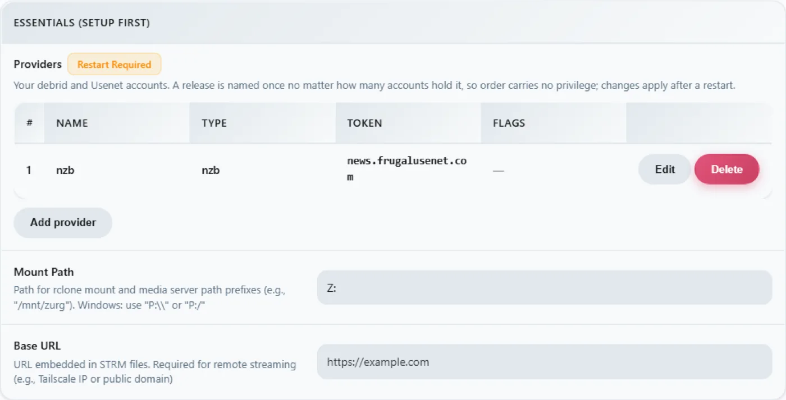

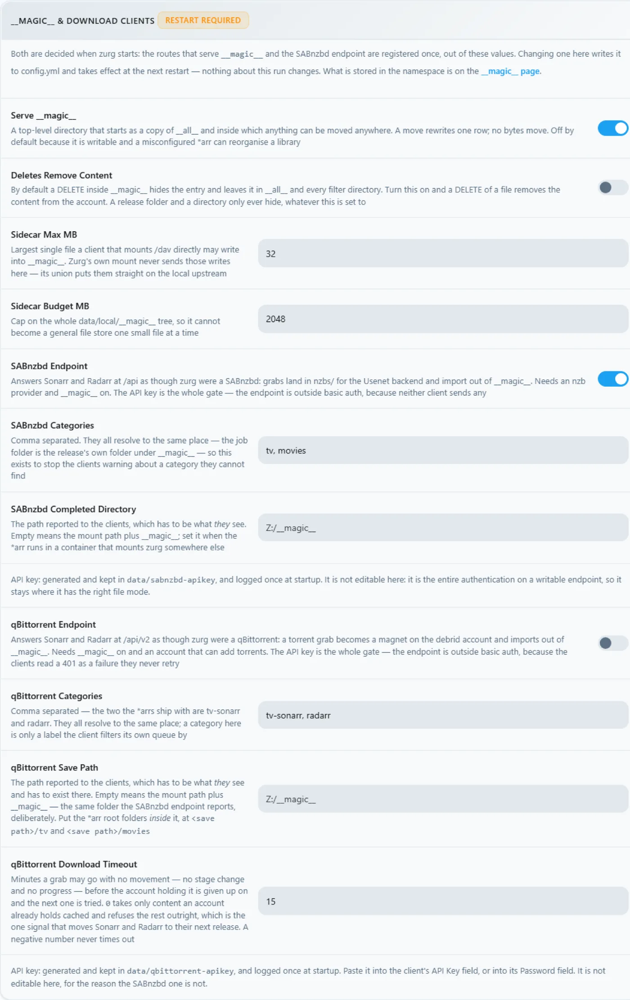

### Drop an NZB in

The `nzbs\` directory is the whole intake. Put one NZB there — downloaded from any indexer — and zurg picks it up:

```powershell
PS> Copy-Item .\lanterns.nzb C:\Users\yowmamasita\zurg\nzbs\
```

```
INFO  nzb  Loaded NZB lanterns.nzb: 8 files
```

That is the line that says the NZB parsed. The release appears as a folder under `__magic__` on the mount, and because a Usenet release names its files however the poster felt like, the inner file may look like `J8AZfuVQCD4yPpRIF566Bv0xKoEpYa3M.mkv` — the release folder carries the NZB's name, the files carry the poster's:

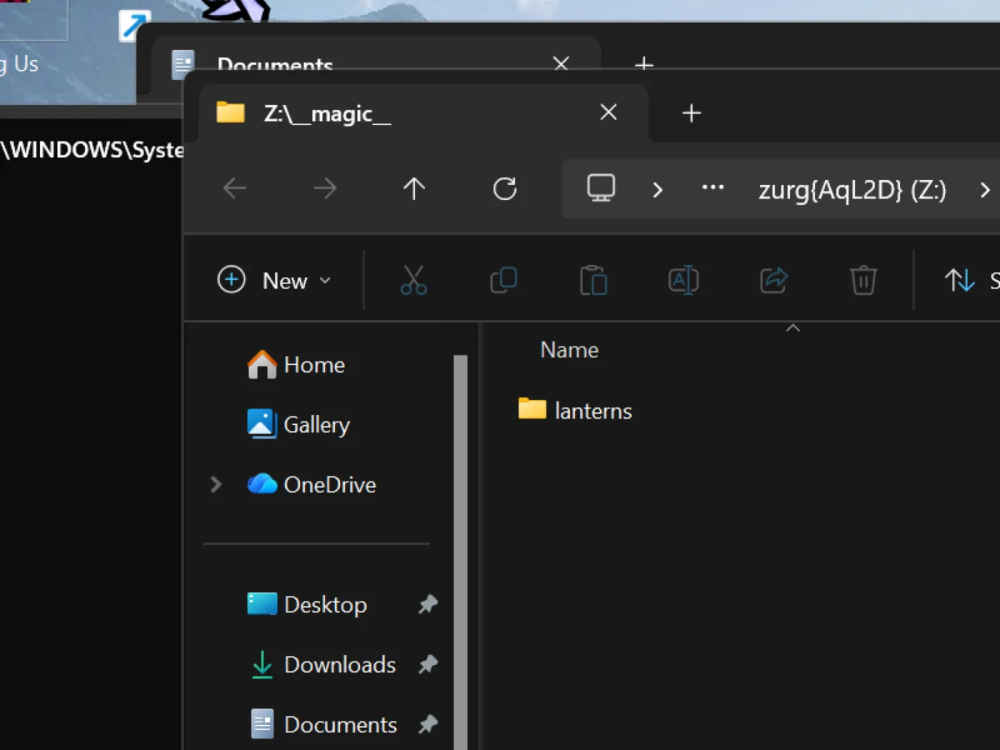

Nothing has been downloaded at this point, and nothing will be until something reads a file. The first read of the episode — 162 MB — fetched exactly the articles covering the requested range, yEnc-decoded them, and answered; later reads were instant because the VFS had read ahead around them. A 60 GB remux costs 60 GB of disk nowhere, Usenet or debrid.

The SABnzbd endpoint answers the same probes as always:

```powershell
PS> $KEY = Get-Content data\sabnzbd-apikey
PS> Invoke-RestMethod "http://localhost:9999/api?mode=version&apikey=$KEY&output=json"
{"version":"4.5.1"}
PS> (Invoke-RestMethod "http://localhost:9999/api?mode=get_config&apikey=$KEY&output=json").config.misc.complete_dir
Z:/__magic__
```

A wrong key is refused in the body, with an HTTP 200 — that is how SABnzbd itself behaves, and zurg copies it:

```powershell
PS> Invoke-RestMethod "http://localhost:9999/api?mode=queue&apikey=wrong&output=json"
{"status":false,"error":"API Key Incorrect"}
```

For the client side — Sonarr, Radarr, categories, root folders under `Z:\__magic__` — the [Usenet walkthrough](../guides/sonarr-radarr.md) is the step-by-step, and every path in it maps by replacing `/mnt/zurg/__magic__` with `Z:\__magic__`. The [Usenet guide](../guides/usenet.md) covers block accounts, retention and repair.

## Keeping it running: the session rules

A drive letter belongs to the logon session that mounted it. In practice, on the machine this page was captured on:

| How zurg was started | The mount |
|---|---|
| A PowerShell window you opened | `Z:` on your desktop |
| SSH (`ssh ben@machine … zurg.exe`) | Works, serves, **invisible on the desktop** — the SSH logon session is not yours |
| `Invoke-CimMethod Win32_Process Create` from SSH | Same — the new process inherits the caller's logon session |
| PsExec `-i 1` | Process on the interactive session, but in its **own** logon session — mount still invisible to the desktop |
| **An interactive scheduled task** | **`Z:` on your desktop** |

The reliable recipe is a scheduled task that runs as you, only when you are logged on:

```powershell
$wdir = "C:\Users\yowmamasita\zurg"
Set-Content "$wdir\start-zurg.cmd" "@echo off`ncd /d $wdir`nzurg.exe --config config.yml"

$action    = New-ScheduledTaskAction -Execute "cmd.exe" -Argument "/c $wdir\start-zurg.cmd"
$trigger   = New-ScheduledTaskTrigger -Once -At (Get-Date).AddSeconds(5)
$principal = New-ScheduledTaskPrincipal -UserId $env:USERNAME -LogonType Interactive
$settings  = New-ScheduledTaskSettingsSet -AllowStartIfOnBatteries -ExecutionTimeLimit ([TimeSpan]::Zero)
Register-ScheduledTask -TaskName "zurg" -Action $action -Trigger $trigger `
  -Principal $principal -Settings $settings -Force
Start-ScheduledTask -TaskName "zurg"
```

A **logon trigger** (`New-ScheduledTaskTrigger -AtLogOn`) instead of `-Once` makes it come back on reboot. `ExecutionTimeLimit ([TimeSpan]::Zero)` matters — without it the Task Scheduler kills the task after 72 hours.

Two traps measured on this box:

- **A console with `-NoExit` wedges the task slot.** If the launcher leaves a window open after zurg stops, the scheduler considers the task still running and every later `Start-ScheduledTask` is refused with `0x800710E0`. `Stop-ScheduledTask zurg` before starting it again, or run the binary directly as above so the task ends when zurg ends.
- **`Get-PSDrive` in one window does not falsify the mount.** The drive is visible to processes in the *same logon session* — your desktop apps — not to every PowerShell you happen to open. If `Z:` is missing in a window, check where that window's session came from before concluding the mount died.

If you do not need Explorer at all — a headless box, or clients that speak HTTP — none of this matters: run zurg however you like and point things at `http://localhost:9999/dav/` or the endpoints. The session rule only governs the drive letter.

## Troubleshooting

| What you see | What it means |
|---|---|
| `Z:` not in Explorer | The session rule — see [above](#keeping-it-running-the-session-rules). The mount is probably fine; check `http://localhost:9999/http/` first. |
| `symlinks not supported without the --links flag` | `--links` missing from `rclone_extra_args`. |
| `Library is still loading` under `__magic__` or `/http/` | The first Real-Debrid run walks the account. Wait; a 3,300-torrent account took ~40 minutes here. An NZB library never says this — it starts empty. |
| `realdebrid will not take <name>: it refuses that name outright` | Real-Debrid blocks some release names (`WEBRip` and friends). Grab a differently-named release; nothing is wrong with the setup. |
| An add fails with `could not read back id=…` or rate-limit text | The account's API budget is spent — on this box, the library walk plus a second zurg on the same token did it. Let the walk finish, or don't share the token across instances. |
| `cannot truncate data\magic.journal: Access is denied` | The Windows journal-compaction refusal. Placements still persist across restarts; the journal just never compacts. |
| `the save path "Z:/__magic__" is not absolute` | A false positive on drive-letter paths. The endpoint works; the clients open `Z:/__magic__` fine. |
| Task start refused, `0x800710E0` | The task is still "running" — a launcher window never exited. `Stop-ScheduledTask zurg`, then start. |
| `Get-PSDrive` shows no `Z:` from an SSH session | Expected — different logon session. See the session table. |

## PowerShell over SSH, for the remote-minded

Windows PowerShell parses some POSIX habits badly, and SSH eats quoting. `&&` is not a separator; `2>/dev/null` is not a redirect; `$_.Property` inside an inline `-Command` arrives mangled. For anything non-trivial, put it in a `.ps1`, copy it over, and run `powershell -ExecutionPolicy Bypass -File C:\path\script.ps1` — the whole rig on this page was driven exactly that way.

## See also

- [Docker](docker.md) and [macOS](macos.md) — the same install on other platforms
- [Sonarr & Radarr, torrents](../guides/sonarr-radarr-torrents.md) — the qBittorrent endpoint end to end, client settings included
- [Sonarr & Radarr](../guides/sonarr-radarr.md) — the SABnzbd endpoint, same
- [Usenet](../guides/usenet.md) — news accounts, retention, repair, the `nzb` backend in depth
- [`__magic__`](../guides/magic.md) — the directory both endpoints import from
